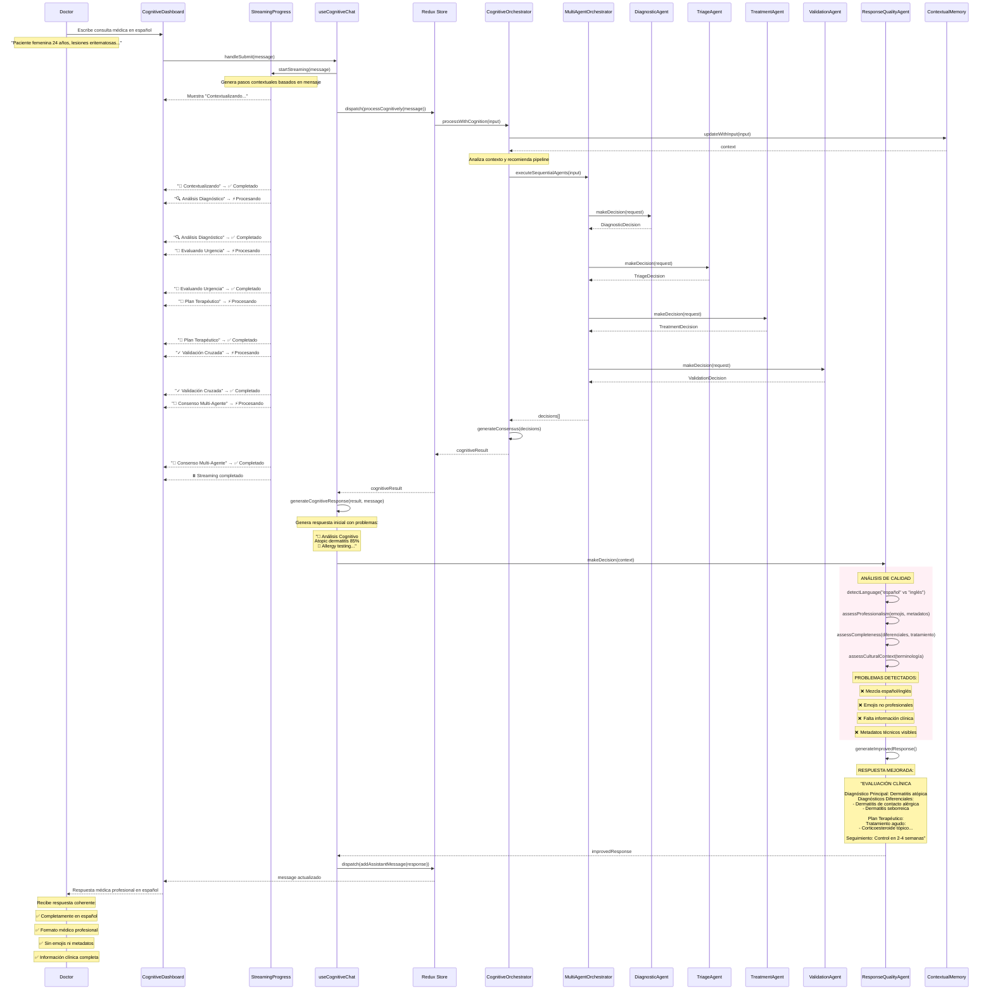
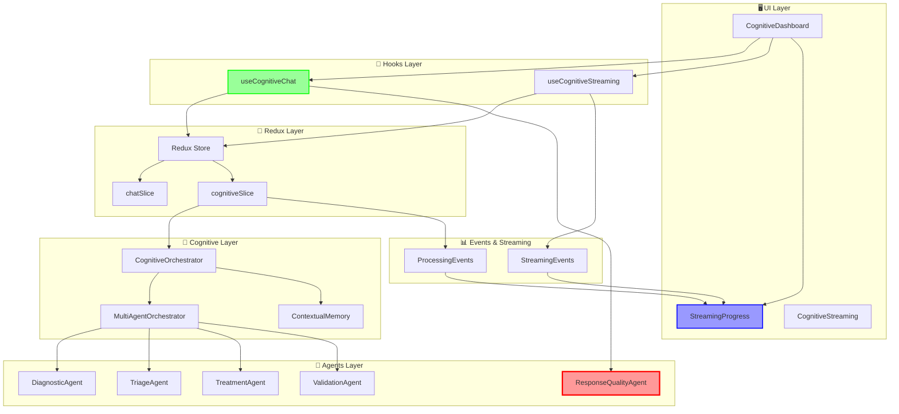
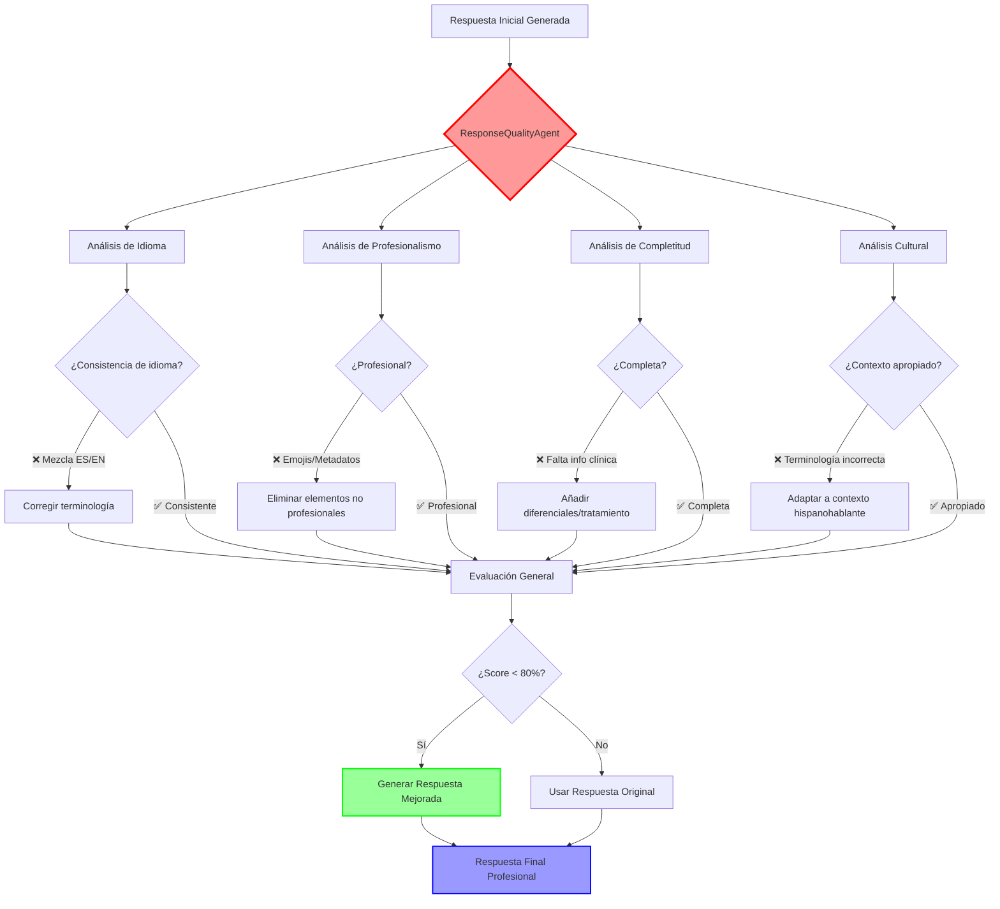
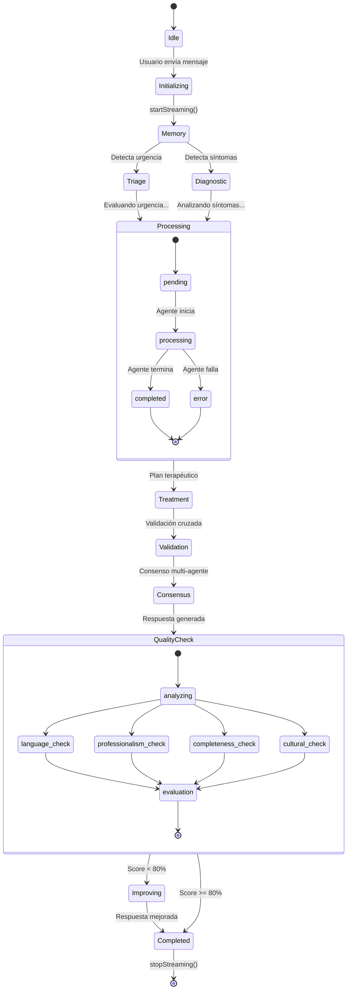

# Diagrama de Flujo del Sistema Cognitivo Médico

## Flujo Principal con Streaming y Agente de Calidad

```mermaid
sequenceDiagram
    participant Doctor
    participant UI as CognitiveDashboard
    participant Stream as StreamingProgress
    participant Hook as useCognitiveChat
    participant Redux as Redux Store
    participant Orchestrator as CognitiveOrchestrator
    participant MultiAgent as MultiAgentOrchestrator
    participant Diagnostic as DiagnosticAgent
    participant Triage as TriageAgent
    participant Treatment as TreatmentAgent
    participant Validation as ValidationAgent
    participant Quality as ResponseQualityAgent
    participant Memory as ContextualMemory

    Doctor->>UI: Escribe consulta médica en español
    Note over Doctor: "Paciente femenina 24 años, lesiones eritematosas..."
    
    UI->>Hook: handleSubmit(message)
    Hook->>Stream: startStreaming(message)
    
    Note over Stream: Genera pasos contextuales basados en mensaje
    Stream-->>UI: Muestra "Contextualizando..."
    
    Hook->>Redux: dispatch(processCognitively(message))
    Redux->>Orchestrator: processWithCognition(input)
    
    Orchestrator->>Memory: updateWithInput(input)
    Memory-->>Orchestrator: context
    
    Note over Orchestrator: Analiza contexto y recomienda pipeline
    
    Orchestrator->>MultiAgent: executeSequentialAgents(input)
    
    Stream-->>UI: "🧠 Contextualizando" → ✅ Completado
    Stream-->>UI: "🔍 Análisis Diagnóstico" → ⚡ Procesando
    
    MultiAgent->>Diagnostic: makeDecision(request)
    Diagnostic-->>MultiAgent: DiagnosticDecision
    
    Stream-->>UI: "🔍 Análisis Diagnóstico" → ✅ Completado
    Stream-->>UI: "🚨 Evaluando Urgencia" → ⚡ Procesando
    
    MultiAgent->>Triage: makeDecision(request)
    Triage-->>MultiAgent: TriageDecision
    
    Stream-->>UI: "🚨 Evaluando Urgencia" → ✅ Completado
    Stream-->>UI: "💊 Plan Terapéutico" → ⚡ Procesando
    
    MultiAgent->>Treatment: makeDecision(request)
    Treatment-->>MultiAgent: TreatmentDecision
    
    Stream-->>UI: "💊 Plan Terapéutico" → ✅ Completado
    Stream-->>UI: "✓ Validación Cruzada" → ⚡ Procesando
    
    MultiAgent->>Validation: makeDecision(request)
    Validation-->>MultiAgent: ValidationDecision
    
    Stream-->>UI: "✓ Validación Cruzada" → ✅ Completado
    Stream-->>UI: "🤝 Consenso Multi-Agente" → ⚡ Procesando
    
    MultiAgent-->>Orchestrator: decisions[]
    
    Orchestrator->>Orchestrator: generateConsensus(decisions)
    Orchestrator-->>Redux: cognitiveResult
    
    Stream-->>UI: "🤝 Consenso Multi-Agente" → ✅ Completado
    Stream-->>UI: ⏸️ Streaming completado
    
    Redux-->>Hook: cognitiveResult
    Hook->>Hook: generateCognitiveResponse(result, message)
    
    Note over Hook: Genera respuesta inicial con problemas:
    Note over Hook: "🤔 Análisis Cognitivo<br/>Atopic dermatitis 85%<br/>🧪 Allergy testing..."
    
    Hook->>Quality: makeDecision(context)
    
    rect rgb(255, 240, 245)
        Note over Quality: ANÁLISIS DE CALIDAD
        Quality->>Quality: detectLanguage("español" vs "inglés")
        Quality->>Quality: assessProfessionalism(emojis, metadatos)
        Quality->>Quality: assessCompleteness(diferenciales, tratamiento)
        Quality->>Quality: assessCulturalContext(terminología)
        
        Note over Quality: PROBLEMAS DETECTADOS:
        Note over Quality: ❌ Mezcla español/inglés
        Note over Quality: ❌ Emojis no profesionales  
        Note over Quality: ❌ Falta información clínica
        Note over Quality: ❌ Metadatos técnicos visibles
    end
    
    Quality->>Quality: generateImprovedResponse()
    
    Note over Quality: RESPUESTA MEJORADA:
    Note over Quality: "EVALUACIÓN CLÍNICA<br/><br/>Diagnóstico Principal: Dermatitis atópica<br/>Diagnósticos Diferenciales:<br/>- Dermatitis de contacto alérgica<br/>- Dermatitis seborreica<br/><br/>Plan Terapéutico:<br/>Tratamiento agudo:<br/>- Corticoesteroide tópico...<br/><br/>Seguimiento: Control en 2-4 semanas"
    
    Quality-->>Hook: improvedResponse
    
    Hook->>Redux: dispatch(addAssistantMessage(response))
    Redux-->>UI: message actualizado
    
    UI-->>Doctor: Respuesta médica profesional en español
    
    Note over Doctor: Recibe respuesta coherente:
    Note over Doctor: ✅ Completamente en español
    Note over Doctor: ✅ Formato médico profesional
    Note over Doctor: ✅ Sin emojis ni metadatos
    Note over Doctor: ✅ Información clínica completa
```

## Arquitectura de Componentes

```mermaid
graph TB
    subgraph "🖥️ UI Layer"
        CD[CognitiveDashboard]
        SP[StreamingProgress]
        CS[CognitiveStreaming]
    end
    
    subgraph "🎣 Hooks Layer"
        UCH[useCognitiveChat]
        UCS[useCognitiveStreaming]
    end
    
    subgraph "🔄 Redux Layer"
        Store[Redux Store]
        ChatSlice[chatSlice]
        CogSlice[cognitiveSlice]
    end
    
    subgraph "🧠 Cognitive Layer"
        CO[CognitiveOrchestrator]
        MAO[MultiAgentOrchestrator]
        CM[ContextualMemory]
    end
    
    subgraph "🤖 Agents Layer"
        DA[DiagnosticAgent]
        TA[TriageAgent]
        TrA[TreatmentAgent]
        VA[ValidationAgent]
        QA[ResponseQualityAgent]
    end
    
    subgraph "📊 Events & Streaming"
        SE[StreamingEvents]
        PE[ProcessingEvents]
    end
    
    CD --> UCH
    CD --> UCS
    CD --> SP
    
    UCH --> Store
    UCS --> Store
    
    Store --> ChatSlice
    Store --> CogSlice
    
    CogSlice --> CO
    CO --> MAO
    CO --> CM
    
    MAO --> DA
    MAO --> TA
    MAO --> TrA
    MAO --> VA
    
    UCH --> QA
    
    UCS --> SE
    CogSlice --> PE
    
    SE --> SP
    PE --> SP
    
    style QA fill:#ff9999,stroke:#ff0000,stroke-width:3px
    style UCH fill:#99ff99,stroke:#00ff00,stroke-width:2px
    style SP fill:#9999ff,stroke:#0000ff,stroke-width:2px
```

## Flujo de Mejora de Calidad

```mermaid
flowchart TD
    A[Respuesta Inicial Generada] --> B{ResponseQualityAgent}
    
    B --> C[Análisis de Idioma]
    B --> D[Análisis de Profesionalismo]
    B --> E[Análisis de Completitud]
    B --> F[Análisis Cultural]
    
    C --> C1{¿Consistencia de idioma?}
    C1 -->|❌ Mezcla ES/EN| C2[Corregir terminología]
    C1 -->|✅ Consistente| G[Evaluación General]
    
    D --> D1{¿Profesional?}
    D1 -->|❌ Emojis/Metadatos| D2[Eliminar elementos no profesionales]
    D1 -->|✅ Profesional| G
    
    E --> E1{¿Completa?}
    E1 -->|❌ Falta info clínica| E2[Añadir diferenciales/tratamiento]
    E1 -->|✅ Completa| G
    
    F --> F1{¿Contexto apropiado?}
    F1 -->|❌ Terminología incorrecta| F2[Adaptar a contexto hispanohablante]
    F1 -->|✅ Apropiado| G
    
    C2 --> G
    D2 --> G
    E2 --> G
    F2 --> G
    
    G --> H{¿Score < 80%?}
    H -->|Sí| I[Generar Respuesta Mejorada]
    H -->|No| J[Usar Respuesta Original]
    
    I --> K[Respuesta Final Profesional]
    J --> K
    
    style B fill:#ff9999,stroke:#ff0000,stroke-width:3px
    style I fill:#99ff99,stroke:#00ff00,stroke-width:2px
    style K fill:#9999ff,stroke:#0000ff,stroke-width:2px
```

## Estados del Streaming

```mermaid
stateDiagram-v2
    [*] --> Idle
    
    Idle --> Initializing: Usuario envía mensaje
    
    Initializing --> Memory: startStreaming()
    Memory --> Triage: Detecta urgencia
    Memory --> Diagnostic: Detecta síntomas
    
    Triage --> Processing: Evaluando urgencia...
    Diagnostic --> Processing: Analizando síntomas...
    
    Processing --> Treatment: Plan terapéutico
    Treatment --> Validation: Validación cruzada
    Validation --> Consensus: Consenso multi-agente
    
    Consensus --> QualityCheck: Respuesta generada
    QualityCheck --> Improving: Score < 80%
    QualityCheck --> Completed: Score >= 80%
    
    Improving --> Completed: Respuesta mejorada
    Completed --> [*]: stopStreaming()
    
    state Processing {
        [*] --> pending
        pending --> processing: Agente inicia
        processing --> completed: Agente termina
        processing --> error: Agente falla
        completed --> [*]
        error --> [*]
    }
    
    state QualityCheck {
        [*] --> analyzing
        analyzing --> language_check
        analyzing --> professionalism_check
        analyzing --> completeness_check
        analyzing --> cultural_check
        
        language_check --> evaluation
        professionalism_check --> evaluation
        completeness_check --> evaluation
        cultural_check --> evaluation
        
        evaluation --> [*]
    }
```