# Flujo del Sistema Cognitivo Médico AI - Bernard Orozco

## 📋 Descripción General

Este sistema es una plataforma de IA médica cognitiva que procesa conversaciones entre doctores y pacientes para proporcionar análisis médico avanzado, diagnósticos diferenciales, clasificación de urgencia y planes de tratamiento mediante un sistema multi-agente orquestado.

## 🔄 Flujo Principal: Entrada del Doctor

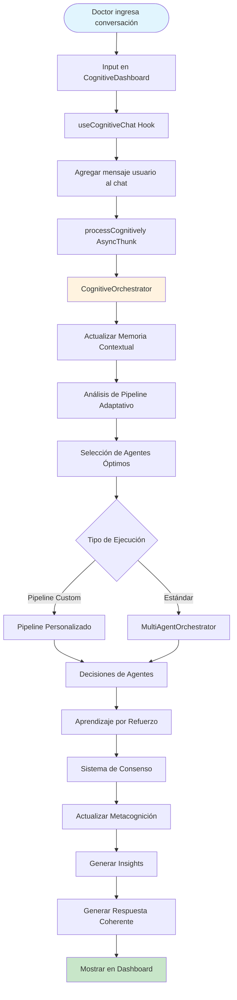

## 🧠 Sistema de Memoria Contextual

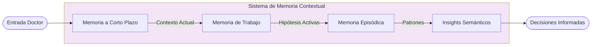

## 🤖 Arquitectura Multi-Agente

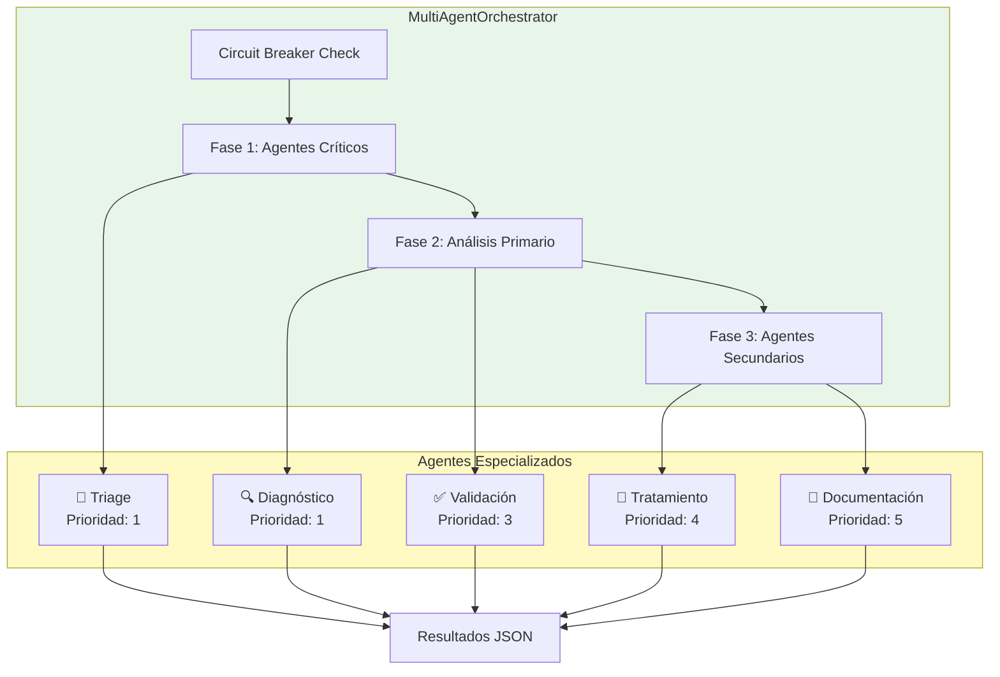

## 🎯 Sistema de Consenso y Votación

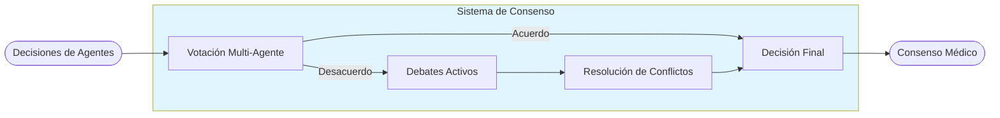

## 📊 Pipeline Adaptativo

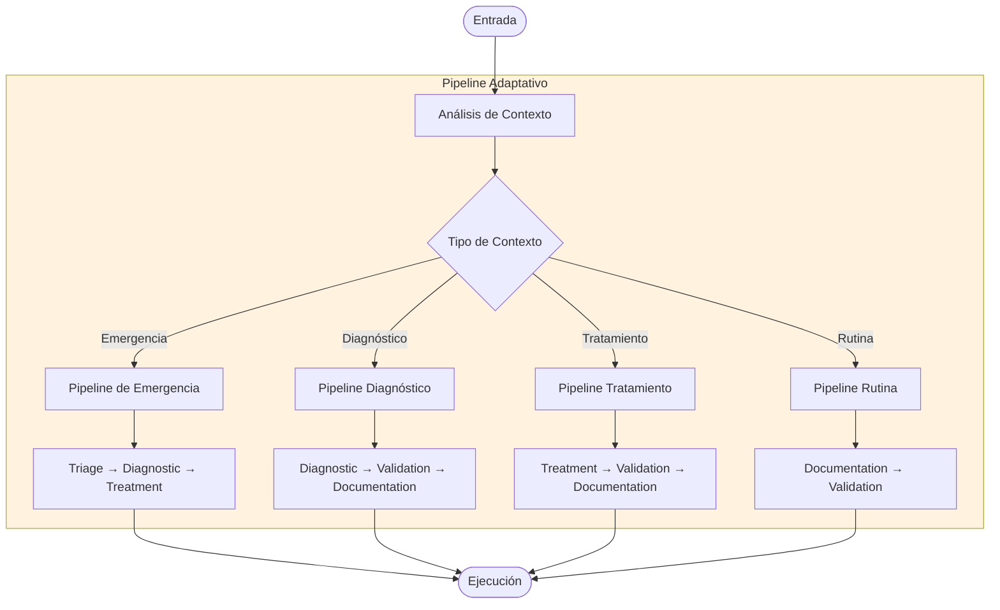

## 🔄 Ciclo de Aprendizaje por Refuerzo

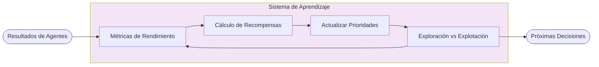

## 🧭 Sistema de Metacognición

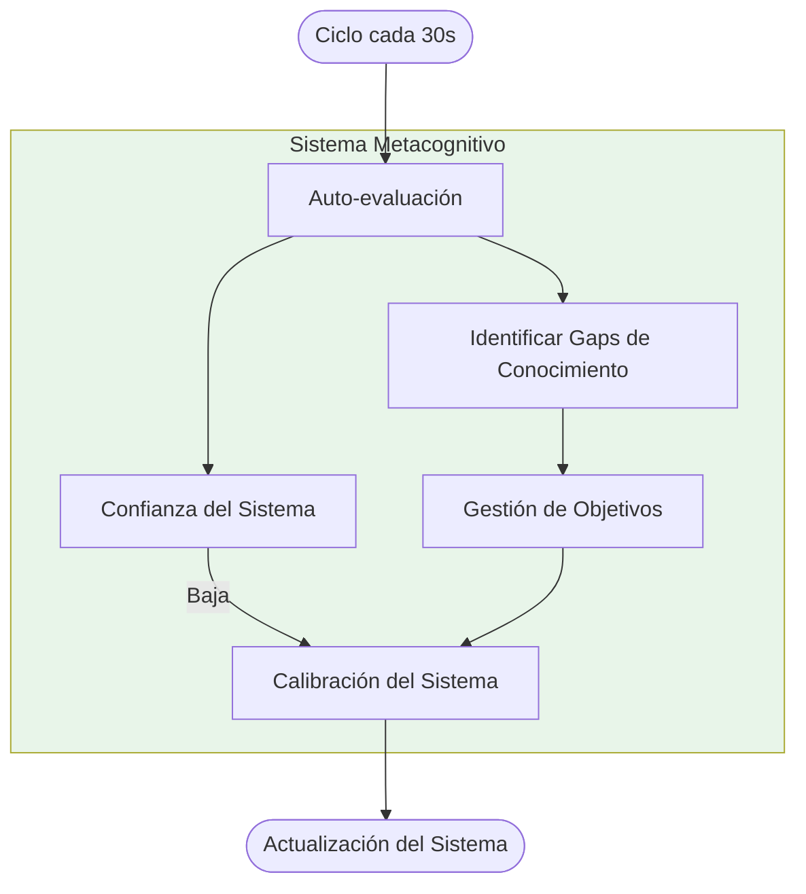

## 📈 Flujo de Respuesta al Doctor

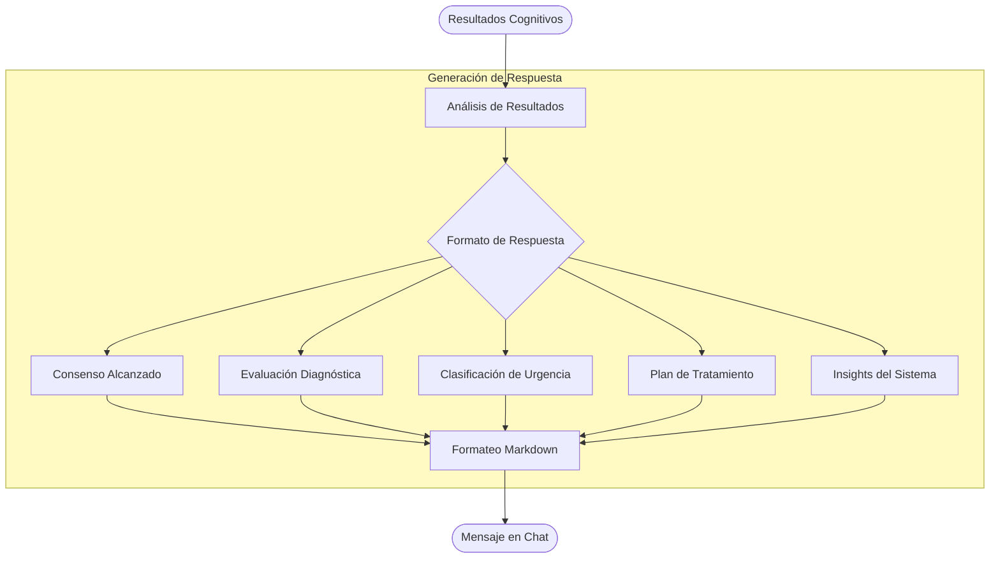

## 🛡️ Sistema de Circuit Breaker

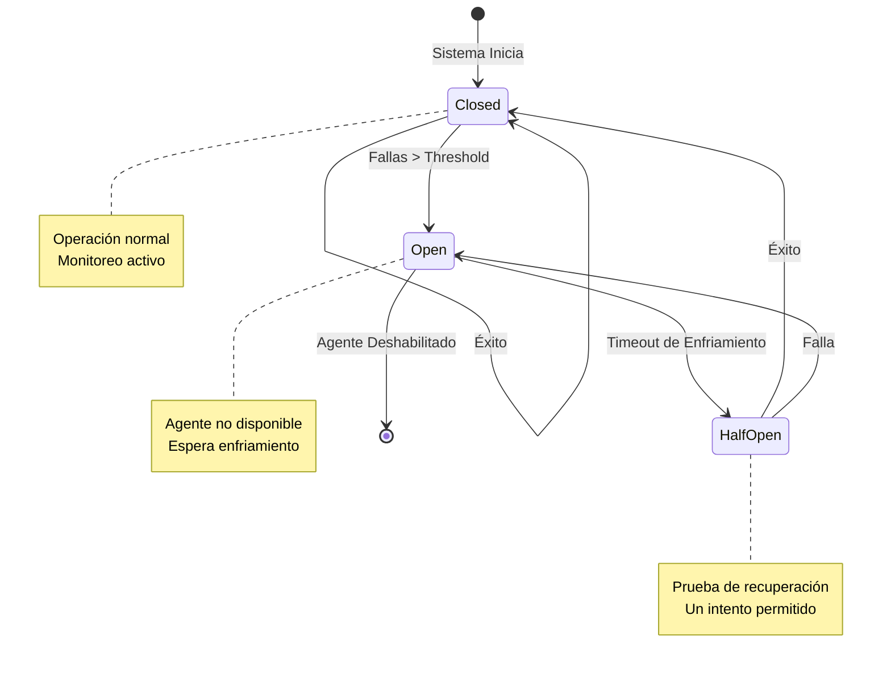

## 🎨 Interfaz de Usuario (Dashboard)

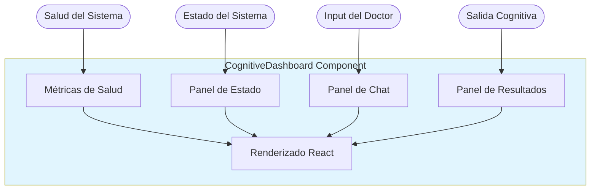

## 📊 Métricas del Sistema

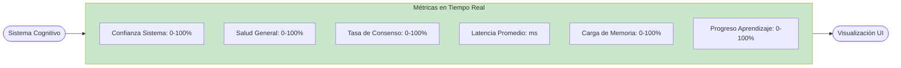

## 🔧 Tecnologías Utilizadas

- **Frontend**: React, Next.js, TypeScript
- **Estado**: Redux Toolkit
- **Estilos**: Tailwind CSS
- **IA**: Claude API (Anthropic)
- **Arquitectura**: Multi-Agente con Orquestación Cognitiva
- **Patrones**: Circuit Breaker, Consenso, Aprendizaje por Refuerzo

## 📌 Características Clave

1. **Procesamiento Cognitivo**: Sistema multi-capa con memoria, aprendizaje y metacognición
2. **Agentes Especializados**: 5 agentes médicos con roles específicos
3. **Pipeline Adaptativo**: Se ajusta según el contexto médico
4. **Sistema de Consenso**: Resolución de conflictos entre agentes
5. **Aprendizaje Continuo**: Mejora con cada interacción
6. **Circuit Breaker**: Protección contra fallas de agentes
7. **Memoria Contextual**: Mantiene contexto entre conversaciones
8. **Metacognición**: Auto-evaluación y calibración del sistema

## 🚀 Flujo de Uso Típico

1. **Doctor ingresa conversación** → Describe síntomas del paciente
2. **Sistema analiza contexto** → Determina urgencia y tipo de caso
3. **Agentes se activan** → Según prioridad y disponibilidad
4. **Procesamiento paralelo** → Múltiples análisis simultáneos
5. **Consenso médico** → Integración de todas las perspectivas
6. **Respuesta estructurada** → Diagnóstico, urgencia, tratamiento
7. **Aprendizaje** → Sistema mejora para próximas consultas

---

*Sistema Cognitivo Médico AI v2.0 - Desarrollado por Bernard Orozco*