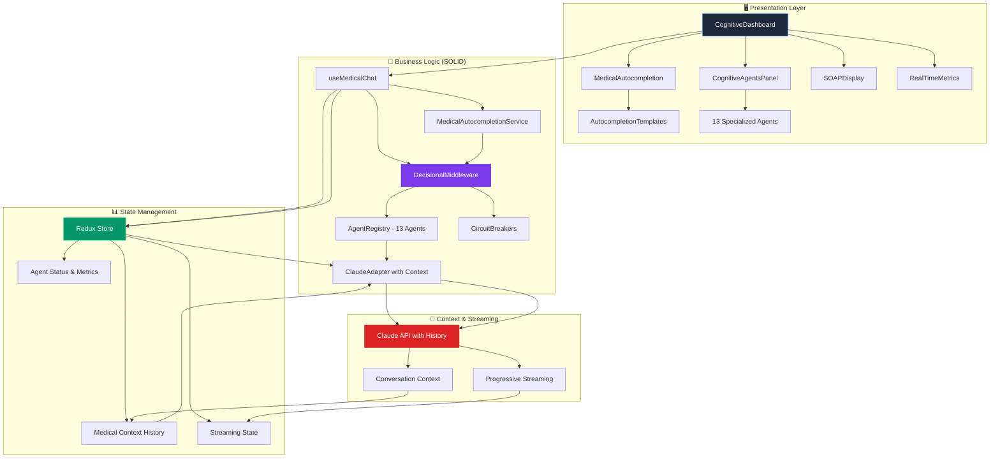
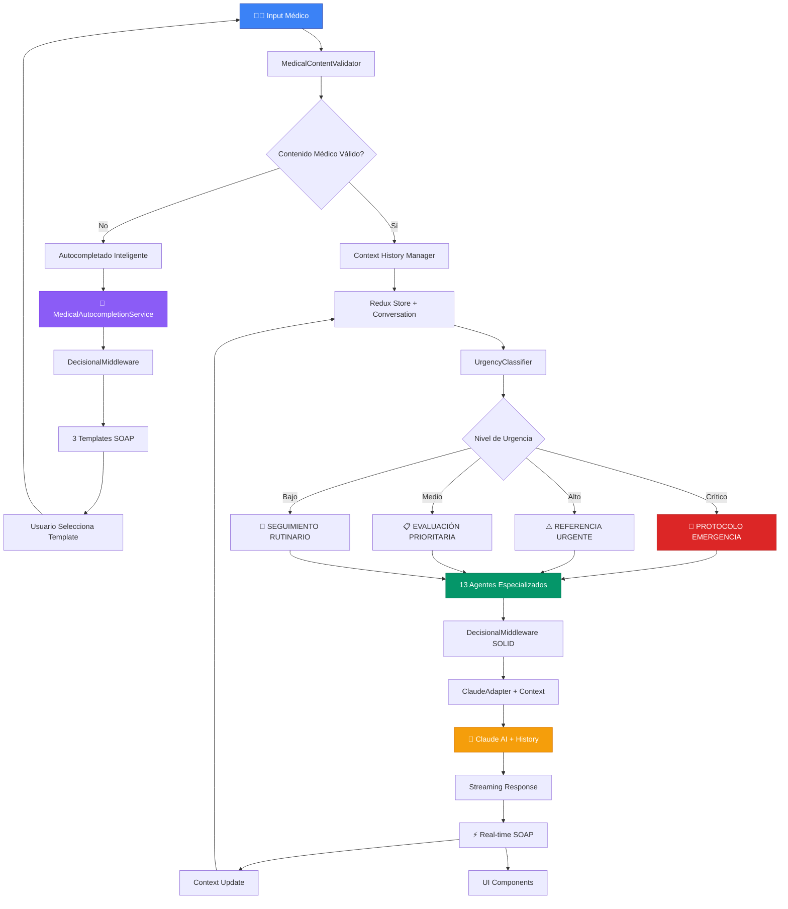
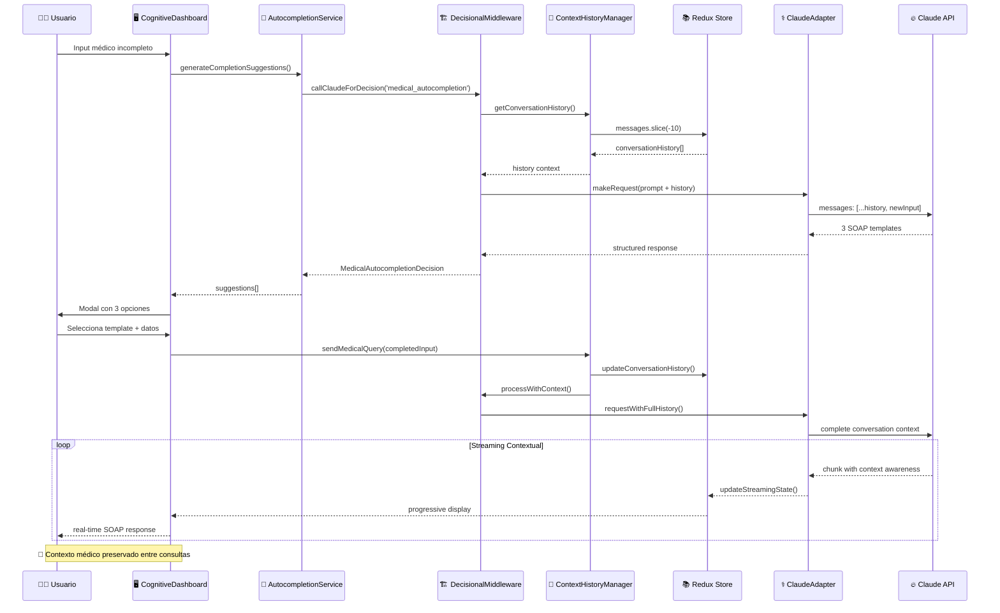
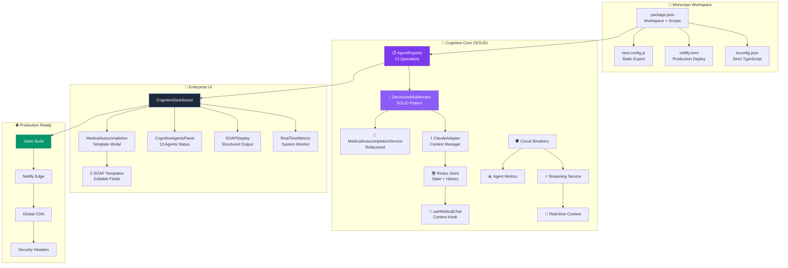

# 🏥 Redux Claude - Plataforma Médica AI Enterprise

[](https://app.netlify.com/sites/your-site-name/deploys)

_Arquitectura SOLID por Bernard Orozco_

## 🚀 Demo en Vivo

🌐 **[Ver Demo](https://redux-claude-medical.netlify.app)** - Sistema médico con
contexto persistente

## 📖 Descripción

Redux Claude es una **plataforma médica enterprise-grade** que combina
**arquitectura SOLID**, **contexto persistente** y **13 agentes especializados**
para crear el sistema médico AI más avanzado de 2025.

### ✨ Características Enterprise

- 🧠 **Contexto médico persistente** - Historial completo entre consultas
- 🤖 **Autocompletado médico inteligente** - Templates SOAP estructurados
- 🛡️ **Medicina defensiva integrada** - Priorización por gravedad
- 🏗️ **Arquitectura SOLID escalable** - 13 agentes especializados
- ⚡ **Streaming en tiempo real** - Respuestas progresivas con Claude AI
- 📱 **Interface médica profesional** - Diseño responsive enterprise
- 🔧 **Circuit breakers y métricas** - Monitoreo en tiempo real

## 🚀 Inicio Rápido

### 📋 Prerrequisitos

- Node.js 18+
- npm o yarn
- Claude API Key (Anthropic)

### ⚡ Instalación

```bash
# Clonar el repositorio
git clone https://github.com/BernardUriza/redux-claude.git
cd redux-claude

# Instalar dependencias
npm install

# Configurar variables de entorno
cp .env.example .env.local
# Edita .env.local con tu ANTHROPIC_API_KEY
```

### 🔑 Variables de Entorno

```bash
# .env.local
ANTHROPIC_API_KEY=your_claude_api_key_here
NEXT_PUBLIC_APP_NAME="Redux Claude Medical"
NEXT_PUBLIC_APP_VERSION="1.0.0"
```

### 🏃‍♂️ Ejecutar en Desarrollo

```bash
# Construir el core package
npm run build:core

# Iniciar servidor de desarrollo
npm run dev
```

Visita [http://localhost:3000](http://localhost:3000) para ver la aplicación.

### 🏗️ Build para Producción

```bash
# Build completo
npm run build

# Iniciar servidor de producción
npm start
```

## 🌐 Despliegue en Netlify

### Método 1: Desde GitHub (Recomendado)

1. **Conecta tu repositorio:**
   - Ve a [Netlify](https://netlify.com)
   - Haz clic en "New site from Git"
   - Conecta tu repositorio de GitHub

2. **Configuración de Build:**

   ```
   Build command: npm run build
   Publish directory: .next
   ```

3. **Variables de Entorno:**
   - `ANTHROPIC_API_KEY`: Tu Claude API key
   - `NEXT_PUBLIC_APP_NAME`: "Redux Claude Medical"

### Método 2: Deploy Manual

```bash
# Instalar Netlify CLI
npm install -g netlify-cli

# Build y deploy
npm run build
netlify deploy --prod --dir=.next
```

### 🔧 Configuración Netlify

El proyecto incluye configuración automática para Netlify con soporte para:

- ✅ Next.js 15 con App Router
- ✅ Monorepo con workspaces
- ✅ Variables de entorno
- ✅ Redirects para SPA
- ✅ Headers de seguridad

---

## 📊 Arquitectura SOLID Enterprise



---

## 🛡️ Flujo de Medicina Defensiva + Autocompletado



---

## ⚡ Flujo SOLID + Contexto Persistente



---

## 🏗️ Arquitectura SOLID Enterprise



---

## 🎯 Características Enterprise

### 🧠 **Contexto Médico Persistente (NUEVO)**

- **ConversationHistoryManager**: Mantiene contexto completo entre consultas
- **ClaudeAdapter + Context**: Envía historial completo a Claude API
- **Redux Store Integration**: Fuente única de verdad para conversaciones
- **convertReduxMessagesToClaudeFormat**: Transformación automática de contexto

### 🤖 **Autocompletado Médico Inteligente (NUEVO)**

- **MedicalAutocompletionService**: Refactorizado con patrón SOLID
- **DecisionalMiddleware Integration**: Reutiliza arquitectura existente
- **3 Templates SOAP**: Básico, Detallado y Especializado automáticos
- **Detección de Especialidades**: Inferencia inteligente de contexto médico

### 🏗️ **Arquitectura SOLID Enterprise**

- **13 Agentes Especializados**: Registry unificado con circuit breakers
- **Single Responsibility**: Cada servicio tiene una función específica
- **Dependency Inversion**: Interfaces abstractas sobre implementaciones
- **Open/Closed**: Sistema extensible sin modificar código base

### 🛡️ **Sistema de Medicina Defensiva Avanzado**

- **UrgencyClassifier**: Priorización por gravedad médica real
- **DefensiveMedicineValidator**: Validación profesional automática
- **Circuit Breakers**: Protección contra fallos de agentes
- **Fallback Systems**: Templates y respuestas de emergencia

### 📊 **Monitoreo y Métricas en Tiempo Real**

- **AgentMetrics**: Métricas individuales por especialista
- **RealTimeMetrics**: Dashboard con estado del sistema
- **Performance Tracking**: Latencia y confianza por agente
- **Health Monitoring**: Estado global de 13 agentes especializados

---

## 🚀 Stack Tecnológico

### 🏗️ **Framework & Build**

- **Next.js 15** con App Router y Static Export
- **TypeScript 5.9** con tipos médicos específicos
- **Monorepo Workspaces** para arquitectura modular
- **Netlify** deployment con headers de seguridad

### 🧠 **AI & Cognitive**

- **@anthropic-ai/sdk** - Claude AI con streaming nativo
- **Custom Decision Engine** - Motor de decisiones médicas
- **Defensive Medicine System** - Medicina defensiva integrada
- **SOAP Processing Engine** - Análisis SOAP automático

### 📊 **State Management**

- **Redux Toolkit** con middleware médico personalizado
- **React-Redux** para conectores de componentes
- **Streaming State Updates** - Actualizaciones en tiempo real
- **Medical Chat Slice** - Estado específico para medicina

### 🎨 **UI/UX Framework**

- **Tailwind CSS v4** con Lightning CSS
- **React Markdown** para renderizado de diagnósticos
- **Corporate Medical Theme** - Diseño médico profesional 2025
- **Responsive Mobile-First** - Optimizado para dispositivos médicos

### 🔧 **Development Tools**

- **Workspace Configuration** - npm workspaces
- **TypeScript Build Pipeline** - Transpilación automática
- **ESLint + Prettier** - Calidad de código médico
- **Hot Reload Development** - Desarrollo iterativo rápido

---

## 🏥 Casos de Uso Implementados

### 🛡️ **Medicina Defensiva**

✅ **Clasificación Automática de Urgencias** - Sistema de triage inteligente  
✅ **Protocolos de Emergencia** - Activación automática para casos críticos  
✅ **Diagnósticos por Gravedad** - Priorización defensiva sobre probabilidad  
✅ **Alertas Visuales Médicas** - Indicadores críticos/altos/medios/bajos

### 📋 **Análisis SOAP Estructurado**

✅ **SOAP Automático** - Procesamiento completo de casos médicos  
✅ **Documentación Médica** - Generación automática de notas clínicas  
✅ **Seguimiento de Pacientes** - Recordatorios y notas con trazabilidad  
✅ **Copy-to-Clipboard** - Exportación directa de diagnósticos

### 🧠 **Motor Cognitivo Avanzado**

✅ **Diagnósticos Iterativos** - Procesamiento en múltiples ciclos  
✅ **Análisis en Tiempo Real** - Streaming progresivo de respuestas  
✅ **Orquestación de Agentes** - Panel de agentes cognitivos coordinados  
✅ **Validación Médica Inteligente** - Filtros profesionales automáticos

### 📱 **Interface Médica Corporativa**

✅ **Dashboard Responsivo** - Multi-pestaña optimizado para medicina  
✅ **Métricas en Tiempo Real** - Monitoreo del sistema cognitivo  
✅ **Dark Mode Médico** - Tema profesional corporativo 2025  
✅ **Mobile-First Design** - Optimizado para dispositivos médicos

---

## 🎭 Por Bernard Orozco

_"Acelerar el desarrollo médico 15-20x vs estimaciones tradicionales usando
Claude Code y arquitectura moderna."_

**Sistema médico que redefine la interacción entre IA y medicina profesional.**

---

_🤖 Sistema optimizado para médicos latinoamericanos con streaming progresivo y
validación inteligente_
