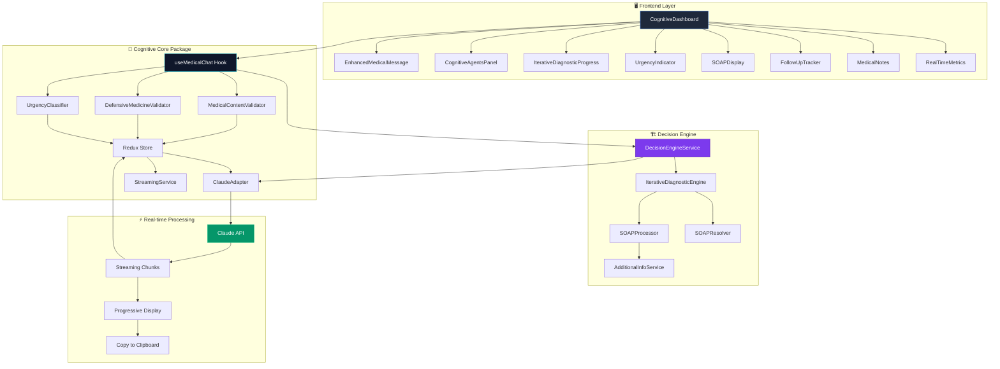
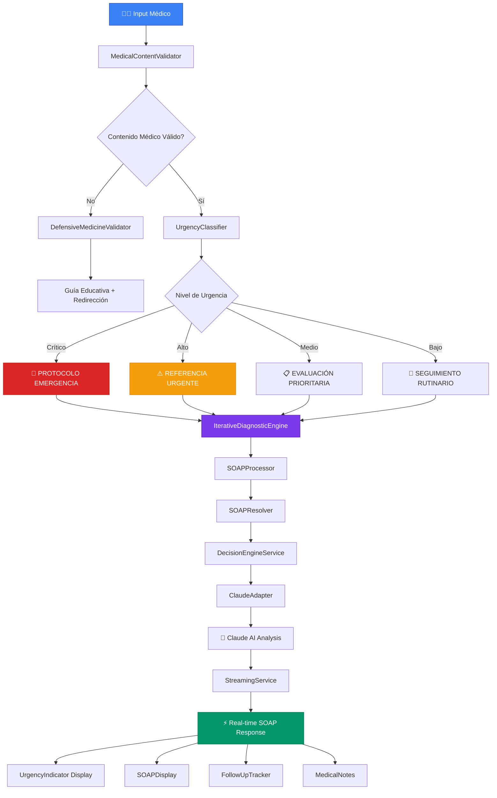
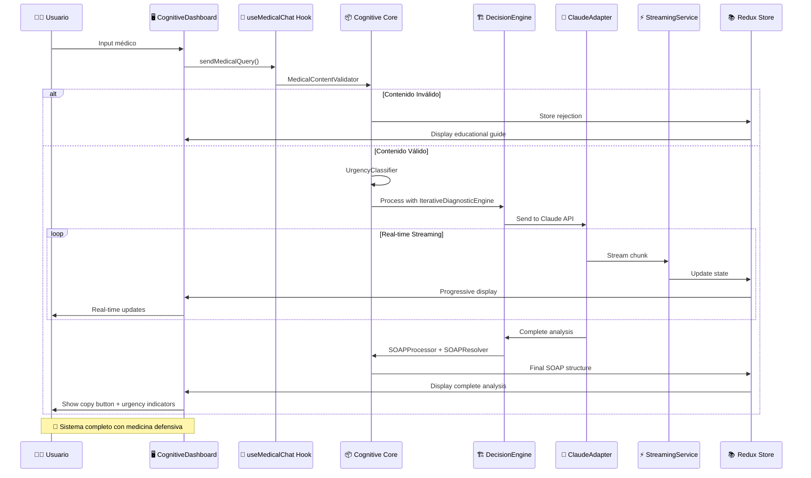
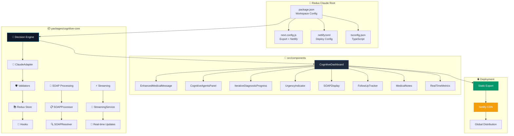

# 🏥 Redux Claude - Sistema Médico AI de Nueva Generación

[](https://app.netlify.com/sites/your-site-name/deploys)

*Creado por Bernard Orozco*

## 🚀 Demo en Vivo

🌐 **[Ver Demo](https://redux-claude-medical.netlify.app)** - Experiencia médica AI en tiempo real

## 📖 Descripción

Redux Claude es una plataforma médica avanzada que combina **streaming en tiempo real**, **validación inteligente** y **arquitectura modular** para crear la experiencia médica más avanzada de 2025.

### ✨ Características Principales

- 🔄 **Streaming en tiempo real** con Claude AI
- 🛡️ **Validación médica inteligente** (150+ términos especializados)
- 📋 **Interface médica profesional** con dark mode
- 🏗️ **Arquitectura monorepo escalable**
- 📱 **Responsive design** para dispositivos médicos
- 📋 **Copy-to-clipboard** para diagnósticos

## 🚀 Inicio Rápido

### 📋 Prerrequisitos

- Node.js 18+ 
- npm o yarn
- Claude API Key (Anthropic)

### ⚡ Instalación

```bash
# Clonar el repositorio
git clone https://github.com/BernardUriza/redux-claude.git
cd redux-claude

# Instalar dependencias
npm install

# Configurar variables de entorno
cp .env.example .env.local
# Edita .env.local con tu ANTHROPIC_API_KEY
```

### 🔑 Variables de Entorno

```bash
# .env.local
ANTHROPIC_API_KEY=your_claude_api_key_here
NEXT_PUBLIC_APP_NAME="Redux Claude Medical"
NEXT_PUBLIC_APP_VERSION="1.0.0"
```

### 🏃‍♂️ Ejecutar en Desarrollo

```bash
# Construir el core package
npm run build:core

# Iniciar servidor de desarrollo
npm run dev
```

Visita [http://localhost:3000](http://localhost:3000) para ver la aplicación.

### 🏗️ Build para Producción

```bash
# Build completo
npm run build

# Iniciar servidor de producción
npm start
```

## 🌐 Despliegue en Netlify

### Método 1: Desde GitHub (Recomendado)

1. **Conecta tu repositorio:**
   - Ve a [Netlify](https://netlify.com)
   - Haz clic en "New site from Git"
   - Conecta tu repositorio de GitHub

2. **Configuración de Build:**
   ```
   Build command: npm run build
   Publish directory: .next
   ```

3. **Variables de Entorno:**
   - `ANTHROPIC_API_KEY`: Tu Claude API key
   - `NEXT_PUBLIC_APP_NAME`: "Redux Claude Medical"

### Método 2: Deploy Manual

```bash
# Instalar Netlify CLI
npm install -g netlify-cli

# Build y deploy
npm run build
netlify deploy --prod --dir=.next
```

### 🔧 Configuración Netlify

El proyecto incluye configuración automática para Netlify con soporte para:
- ✅ Next.js 15 con App Router
- ✅ Monorepo con workspaces
- ✅ Variables de entorno
- ✅ Redirects para SPA
- ✅ Headers de seguridad

---

## 📊 Arquitectura del Sistema Completo



---

## 🛡️ Sistema de Medicina Defensiva (FASE 3)



---

## ⚡ Monorepo + Streaming Architecture



---

## 🏗️ Estructura Monorepo Modular



---

## 🎯 Características del Sistema

### 🛡️ **Sistema de Medicina Defensiva (FASE 3)**
- **DefensiveMedicineValidator**: Valida contenido médico profesional
- **UrgencyClassifier**: Clasifica urgencia por gravedad sobre probabilidad
- **UrgencyIndicator**: Alertas visuales críticas/altas/medias/bajas
- **ProtocoloEmergencia**: Activación automática para casos críticos

### ⚡ **Motor Iterativo + Orquestador Cognitivo**
- **IterativeDiagnosticEngine**: Procesamiento diagnóstico iterativo
- **DecisionEngineService**: Orquestación de decisiones médicas
- **SOAPProcessor + SOAPResolver**: Análisis SOAP estructurado automático
- **AdditionalInfoService**: Solicitud inteligente de información adicional

### 🧠 **Cognitive Core Package Completo**
- **useMedicalChat Hook**: Gestión completa del chat médico
- **Redux Store Médico**: Estado predictible con tipos médicos específicos
- **ClaudeAdapter**: Integración nativa con Claude AI
- **StreamingService**: Streaming en tiempo real palabra por palabra

### 📱 **Interface Médica Profesional**
- **CognitiveDashboard**: Panel principal multi-pestaña responsive
- **EnhancedMedicalMessage**: Mensajes médicos con copy-to-clipboard
- **IterativeDiagnosticProgress**: Progreso diagnóstico en tiempo real
- **CognitiveAgentsPanel**: Panel de agentes cognitivos activos
- **FollowUpTracker**: Seguimiento de recordatorios médicos
- **MedicalNotes**: Notas médicas con trazabilidad completa

### 🌐 **Deploy Production-Ready**
- **Next.js 15 Static Export**: Optimizado para Netlify
- **Monorepo Workspaces**: Gestión modular de dependencias
- **Headers de Seguridad**: CSP, CORS, XSS protection
- **Environment Variables**: Configuración segura de API keys

---

## 🚀 Stack Tecnológico

### 🏗️ **Framework & Build**
- **Next.js 15** con App Router y Static Export
- **TypeScript 5.9** con tipos médicos específicos
- **Monorepo Workspaces** para arquitectura modular
- **Netlify** deployment con headers de seguridad

### 🧠 **AI & Cognitive**
- **@anthropic-ai/sdk** - Claude AI con streaming nativo
- **Custom Decision Engine** - Motor de decisiones médicas
- **Defensive Medicine System** - Medicina defensiva integrada
- **SOAP Processing Engine** - Análisis SOAP automático

### 📊 **State Management**
- **Redux Toolkit** con middleware médico personalizado
- **React-Redux** para conectores de componentes
- **Streaming State Updates** - Actualizaciones en tiempo real
- **Medical Chat Slice** - Estado específico para medicina

### 🎨 **UI/UX Framework**
- **Tailwind CSS v4** con Lightning CSS
- **React Markdown** para renderizado de diagnósticos
- **Corporate Medical Theme** - Diseño médico profesional 2025
- **Responsive Mobile-First** - Optimizado para dispositivos médicos

### 🔧 **Development Tools**
- **Workspace Configuration** - npm workspaces
- **TypeScript Build Pipeline** - Transpilación automática
- **ESLint + Prettier** - Calidad de código médico
- **Hot Reload Development** - Desarrollo iterativo rápido

---

## 🏥 Casos de Uso Implementados

### 🛡️ **Medicina Defensiva**
✅ **Clasificación Automática de Urgencias** - Sistema de triage inteligente  
✅ **Protocolos de Emergencia** - Activación automática para casos críticos  
✅ **Diagnósticos por Gravedad** - Priorización defensiva sobre probabilidad  
✅ **Alertas Visuales Médicas** - Indicadores críticos/altos/medios/bajos  

### 📋 **Análisis SOAP Estructurado**
✅ **SOAP Automático** - Procesamiento completo de casos médicos  
✅ **Documentación Médica** - Generación automática de notas clínicas  
✅ **Seguimiento de Pacientes** - Recordatorios y notas con trazabilidad  
✅ **Copy-to-Clipboard** - Exportación directa de diagnósticos  

### 🧠 **Motor Cognitivo Avanzado**
✅ **Diagnósticos Iterativos** - Procesamiento en múltiples ciclos  
✅ **Análisis en Tiempo Real** - Streaming progresivo de respuestas  
✅ **Orquestación de Agentes** - Panel de agentes cognitivos coordinados  
✅ **Validación Médica Inteligente** - Filtros profesionales automáticos  

### 📱 **Interface Médica Corporativa**
✅ **Dashboard Responsivo** - Multi-pestaña optimizado para medicina  
✅ **Métricas en Tiempo Real** - Monitoreo del sistema cognitivo  
✅ **Dark Mode Médico** - Tema profesional corporativo 2025  
✅ **Mobile-First Design** - Optimizado para dispositivos médicos

---

## 🎭 Por Bernard Orozco

*"Acelerar el desarrollo médico 15-20x vs estimaciones tradicionales usando Claude Code y arquitectura moderna."*

**Sistema médico que redefine la interacción entre IA y medicina profesional.**

---

*🤖 Sistema optimizado para médicos latinoamericanos con streaming progresivo y validación inteligente*