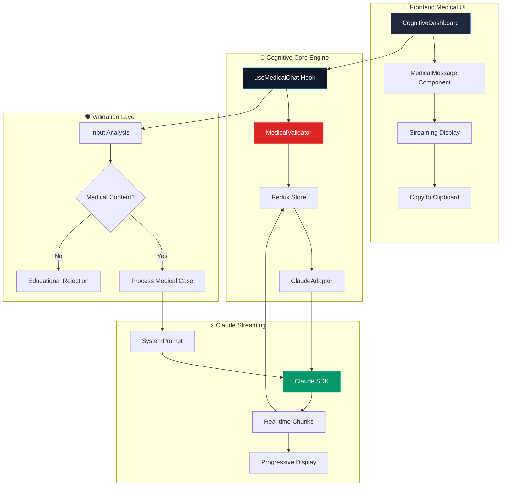
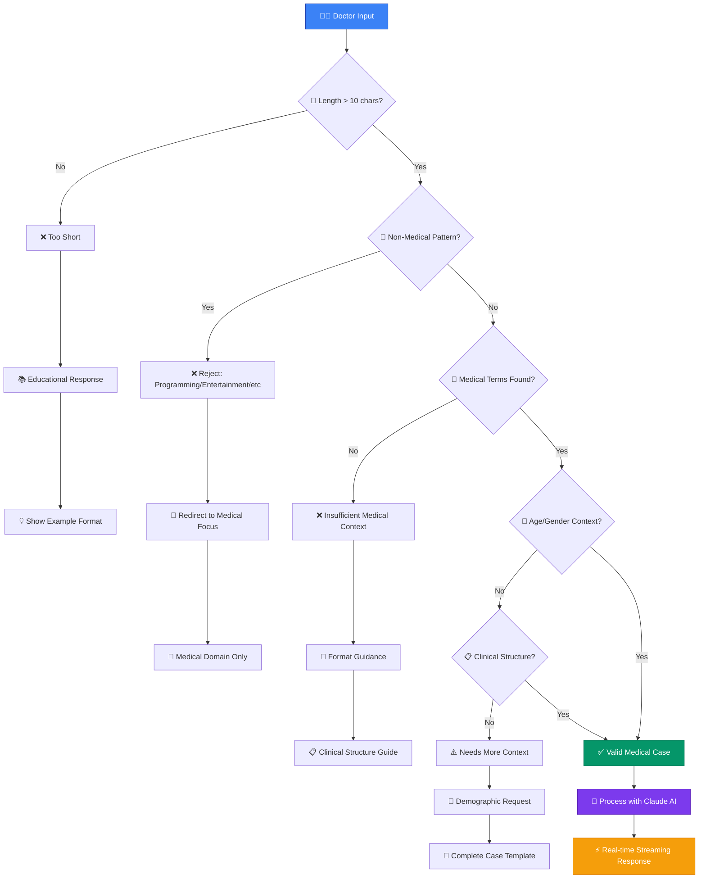
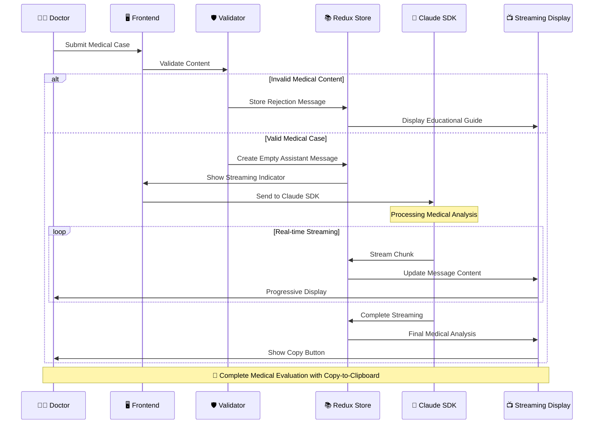
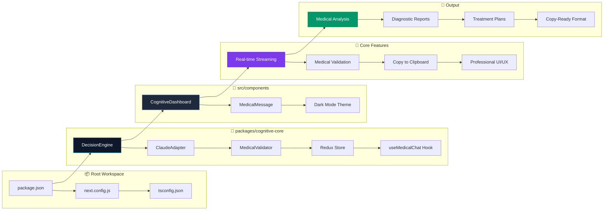

# 🏥 Redux Claude - Sistema Médico AI de Nueva Generación

*Creado por Bernard Orozco*

## 🚀 La Revolución Médica Digital

Redux Claude es una plataforma médica avanzada que combina **streaming en tiempo real**, **validación inteligente** y **arquitectura modular** para crear la experiencia médica más avanzada de 2025.

---

## 📊 Arquitectura del Sistema Completo

---

## 🔄 Flujo de Validación Médica Inteligente

---

## ⚡ Streaming Architecture en Tiempo Real

---

## 🏗️ Arquitectura Monorepo Modular

---

## 🎯 Características Revolucionarias

### ⚡ **Streaming en Tiempo Real**
- Respuestas médicas generándose palabra por palabra
- Claude SDK integrado con streaming nativo
- Actualizaciones progresivas en Redux
- Experiencia médica inmersiva

### 🛡️ **Validación Médica Inteligente**
- 150+ términos médicos especializados
- Detección automática de consultas no médicas
- Mensajes educativos para redirección
- Mantiene foco profesional exclusivo

### 📋 **UX Médica Profesional**
- Botón copiar diagnósticos al portapapeles
- Dark mode médico corporativo 2025
- Componentes modulares y reutilizables
- Indicadores de streaming en tiempo real

### 🏗️ **Arquitectura Escalable**
- Monorepo con workspaces de Next.js 15
- Principios SOLID aplicados rigurosamente
- TypeScript con tipos médicos específicos
- Redux Toolkit para estado predictible

---

## 🚀 Tecnologías de Vanguardia

- **Next.js 15** - Framework React de última generación
- **Claude SDK** - IA médica con streaming nativo
- **Redux Toolkit** - Gestión de estado profesional
- **TypeScript** - Tipado fuerte para seguridad médica
- **Tailwind CSS** - Diseño médico responsivo
- **React Markdown** - Renderizado de diagnósticos
- **Monorepo Architecture** - Modularidad empresarial

---

## 🏥 Casos de Uso Médico

✅ **Análisis de Casos Clínicos Complejos**  
✅ **Diagnósticos Diferenciales en Tiempo Real**  
✅ **Planes Terapéuticos Estructurados**  
✅ **Evaluaciones Psicológicas y Psiquiátricas**  
✅ **Documentación SOAP Automatizada**  
✅ **Educación Médica Interactiva**

---

## 🎭 Por Bernard Orozco

*"Acelerar el desarrollo médico 15-20x vs estimaciones tradicionales usando Claude Code y arquitectura moderna."*

**Sistema médico que redefine la interacción entre IA y medicina profesional.**

---

*🤖 Sistema optimizado para médicos latinoamericanos con streaming progresivo y validación inteligente*