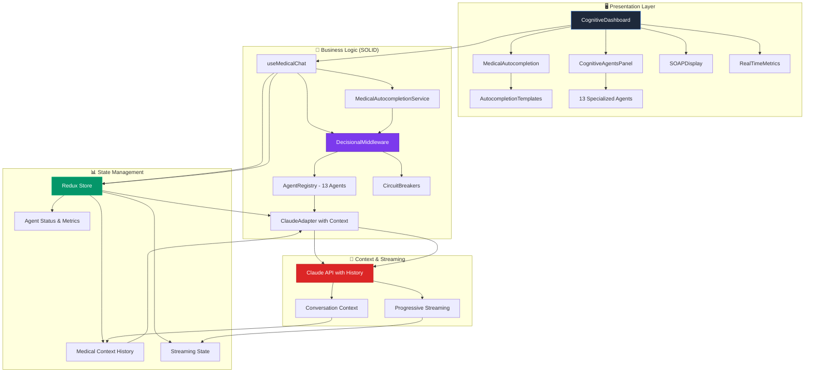
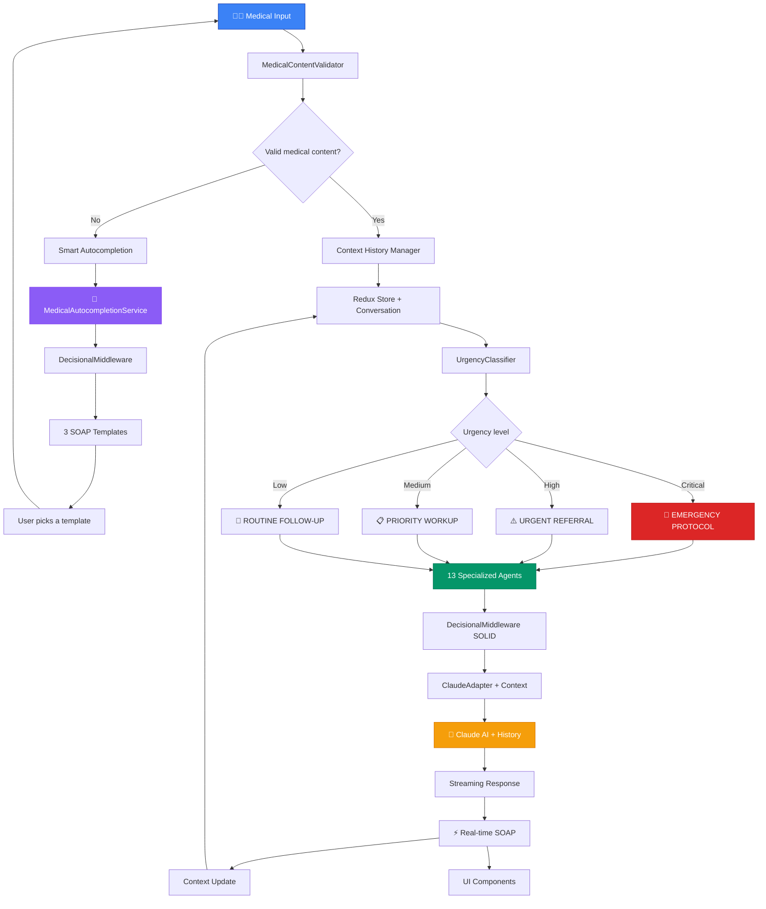
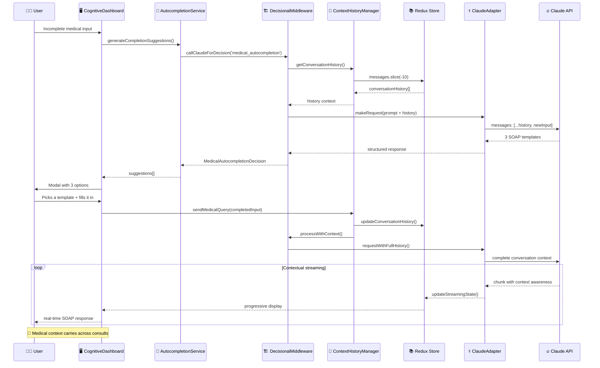
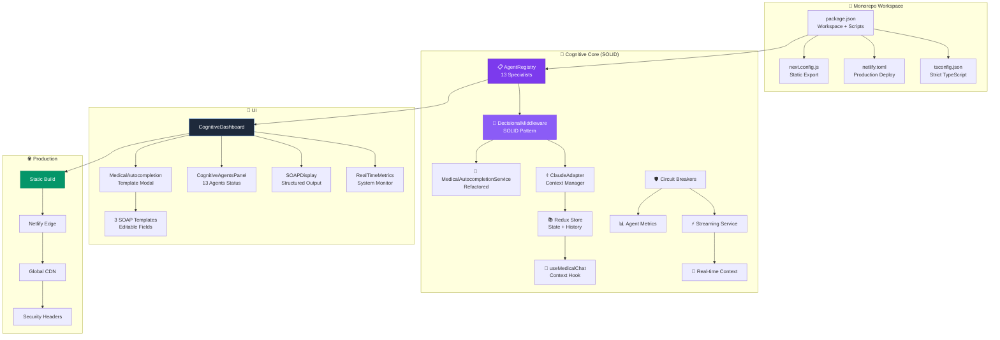

# 🏥 Redux Claude — AI Medical Platform

_SOLID architecture by Bernard Orozco_

## 📖 What This Is

Redux Claude is a clinical-decision-support app built on Next.js, Redux Toolkit and the Claude API. You type a case, it keeps the full conversation context, routes the case through 13 specialized agents, and streams back a structured SOAP note.

What you get:

- 🧠 **Persistent medical context** — every consult carries the prior history.
- 🤖 **Smart autocompletion** — turns a half-written case into three structured SOAP templates.
- 🛡️ **Defensive-medicine logic** — triage by severity, not by likelihood.
- 🏗️ **SOLID architecture** — 13 specialized agents behind one registry.
- ⚡ **Real-time streaming** — responses render as Claude writes them.
- 📱 **Responsive clinical UI** — built mobile-first.
- 🔧 **Circuit breakers and metrics** — per-agent health you can watch live.

## 🚀 Quick Start

### 📋 Requirements

- Node.js 18+
- npm or yarn
- A Claude API key from Anthropic

### ⚡ Install

```bash
# Clone the repo
git clone https://github.com/BernardUriza/redux-claude.git
cd redux-claude

# Install dependencies
npm install

# Set up your environment
cp .env.example .env.local
# Then put your ANTHROPIC_API_KEY in .env.local
```

### 🔑 Environment Variables

```bash
# .env.local
ANTHROPIC_API_KEY=your_claude_api_key_here
NEXT_PUBLIC_APP_NAME="Redux Claude Medical"
NEXT_PUBLIC_APP_VERSION="1.0.0"
```

### 🏃‍♂️ Run It in Dev

```bash
# Build the core package first
npm run build:core

# Start the dev server
npm run dev
```

Open [http://localhost:3000](http://localhost:3000).

### 🏗️ Production Build

```bash
# Full build
npm run build

# Start the production server
npm start
```

## 🌐 Deploying to Netlify

### Option 1: From GitHub (recommended)

1. **Connect the repo:**
   - Go to [Netlify](https://netlify.com)
   - Click "New site from Git"
   - Pick this GitHub repo

2. **Build settings:**

   ```
   Build command: npm run build
   Publish directory: .next
   ```

3. **Environment variables:**
   - `ANTHROPIC_API_KEY`: your Claude API key
   - `NEXT_PUBLIC_APP_NAME`: "Redux Claude Medical"

### Option 2: Deploy by hand

```bash
# Install the Netlify CLI
npm install -g netlify-cli

# Build and ship
npm run build
netlify deploy --prod --dir=.next
```

### 🔧 What's Already Wired Up

The repo ships with Netlify config for:

- ✅ Next.js 15 with the App Router
- ✅ Monorepo workspaces
- ✅ Environment variables
- ✅ SPA redirects
- ✅ Security headers

---

## 📊 Architecture


```mermaid
graph TB
    subgraph "🖥️ Presentation Layer"
        A[CognitiveDashboard] --> B[MedicalAutocompletion]
        A --> C[CognitiveAgentsPanel]
        A --> D[SOAPDisplay]
        A --> E[RealTimeMetrics]
        B --> F[AutocompletionTemplates]
        C --> G[13 Specialized Agents]
    end

    subgraph "🧠 Business Logic (SOLID)"
        H[useMedicalChat] --> I[MedicalAutocompletionService]
        H --> J[DecisionalMiddleware]
        I --> J
        J --> K[AgentRegistry - 13 Agents]
        J --> L[CircuitBreakers]
        K --> M[ClaudeAdapter with Context]
    end

    subgraph "📊 State Management"
        N[Redux Store] --> O[Medical Context History]
        N --> P[Agent Status & Metrics]
        N --> Q[Streaming State]
        O --> M
        H --> N
    end

    subgraph "🔄 Context & Streaming"
        M --> R[Claude API with History]
        R --> S[Conversation Context]
        R --> T[Progressive Streaming]
        S --> O
        T --> Q
    end

    A --> H
    H --> N
    N --> M
    M --> R

    style A fill:#1e293b,stroke:#3b82f6,color:#fff
    style J fill:#7c3aed,stroke:#5b21b6,color:#fff
    style N fill:#059669,stroke:#10b981,color:#fff
    style R fill:#dc2626,stroke:#b91c1c,color:#fff
```

---

## 🛡️ Defensive Medicine + Autocompletion Flow


```mermaid
flowchart TD
    A[👨‍⚕️ Medical Input] --> B[MedicalContentValidator]
    B --> C{Valid medical content?}

    C -->|No| D[Smart Autocompletion]
    D --> E[🤖 MedicalAutocompletionService]
    E --> F[DecisionalMiddleware]
    F --> G[3 SOAP Templates]
    G --> H[User picks a template]
    H --> A

    C -->|Yes| I[Context History Manager]
    I --> J[Redux Store + Conversation]
    J --> K[UrgencyClassifier]
    K --> L{Urgency level}

    L -->|Critical| M[🚨 EMERGENCY PROTOCOL]
    L -->|High| N[⚠️ URGENT REFERRAL]
    L -->|Medium| O[📋 PRIORITY WORKUP]
    L -->|Low| P[📅 ROUTINE FOLLOW-UP]

    M --> Q[13 Specialized Agents]
    N --> Q
    O --> Q
    P --> Q

    Q --> R[DecisionalMiddleware SOLID]
    R --> S[ClaudeAdapter + Context]
    S --> T[🤖 Claude AI + History]
    T --> U[Streaming Response]
    U --> V[⚡ Real-time SOAP]

    V --> W[Context Update]
    W --> J
    V --> X[UI Components]

    style A fill:#3b82f6,stroke:#1e40af,color:#fff
    style E fill:#8b5cf6,stroke:#7c3aed,color:#fff
    style M fill:#dc2626,stroke:#b91c1c,color:#fff
    style Q fill:#059669,stroke:#047857,color:#fff
    style T fill:#f59e0b,stroke:#d97706,color:#fff
```

---

## ⚡ Request Lifecycle


```mermaid
sequenceDiagram
    participant U as 👨‍⚕️ User
    participant CD as 🖥️ CognitiveDashboard
    participant AS as 🤖 AutocompletionService
    participant DM as 🏗️ DecisionalMiddleware
    participant CH as 🧠 ContextHistoryManager
    participant RS as 📚 Redux Store
    participant CA as ⚕️ ClaudeAdapter
    participant API as 🔥 Claude API

    U->>CD: Incomplete medical input
    CD->>AS: generateCompletionSuggestions()
    AS->>DM: callClaudeForDecision('medical_autocompletion')
    DM->>CH: getConversationHistory()
    CH->>RS: messages.slice(-10)
    RS-->>CH: conversationHistory[]
    CH-->>DM: history context
    DM->>CA: makeRequest(prompt + history)
    CA->>API: messages: [...history, newInput]
    API-->>CA: 3 SOAP templates
    CA-->>DM: structured response
    DM-->>AS: MedicalAutocompletionDecision
    AS-->>CD: suggestions[]
    CD->>U: Modal with 3 options

    U->>CD: Picks a template + fills it in
    CD->>CH: sendMedicalQuery(completedInput)
    CH->>RS: updateConversationHistory()
    CH->>DM: processWithContext()
    DM->>CA: requestWithFullHistory()
    CA->>API: complete conversation context

    loop Contextual streaming
        API-->>CA: chunk with context awareness
        CA-->>RS: updateStreamingState()
        RS-->>CD: progressive display
        CD-->>U: real-time SOAP response
    end

    Note over U,CD: 🧠 Medical context carries across consults
```

---

## 🏗️ Repo Layout


```mermaid
graph TB
    subgraph "📂 Monorepo Workspace"
        A[package.json<br/>Workspace + Scripts] --> B[next.config.js<br/>Static Export]
        A --> C[netlify.toml<br/>Production Deploy]
        A --> D[tsconfig.json<br/>Strict TypeScript]
    end

    subgraph "🧠 Cognitive Core (SOLID)"
        E[📋 AgentRegistry<br/>13 Specialists] --> F[🔧 DecisionalMiddleware<br/>SOLID Pattern]
        F --> G[🤖 MedicalAutocompletionService<br/>Refactored]
        F --> H[⚕️ ClaudeAdapter<br/>Context Manager]
        H --> I[📚 Redux Store<br/>State + History]
        I --> J[🔗 useMedicalChat<br/>Context Hook]

        K[🛡️ Circuit Breakers] --> L[📊 Agent Metrics]
        K --> M[⚡ Streaming Service]
        M --> N[🔄 Real-time Context]
    end

    subgraph "🎨 UI"
        O[CognitiveDashboard] --> P[MedicalAutocompletion<br/>Template Modal]
        O --> Q[CognitiveAgentsPanel<br/>13 Agents Status]
        O --> R[SOAPDisplay<br/>Structured Output]
        O --> S[RealTimeMetrics<br/>System Monitor]
        P --> T[3 SOAP Templates<br/>Editable Fields]
    end

    subgraph "🌐 Production"
        U[Static Build] --> V[Netlify Edge]
        V --> W[Global CDN]
        W --> X[Security Headers]
    end

    A --> E
    E --> O
    O --> U

    style E fill:#7c3aed,stroke:#5b21b6,color:#fff
    style F fill:#8b5cf6,stroke:#7c3aed,color:#fff
    style O fill:#1e293b,stroke:#3b82f6,color:#fff
    style U fill:#059669,stroke:#047857,color:#fff
```

---

## 🎯 How the Pieces Work

### 🧠 Persistent medical context

- **ConversationHistoryManager** — holds the full context between consults.
- **ClaudeAdapter + Context** — sends the whole history to the Claude API.
- **Redux store integration** — one source of truth for every conversation.
- **convertReduxMessagesToClaudeFormat** — converts store messages into Claude's message format.

### 🤖 Smart medical autocompletion

- **MedicalAutocompletionService** — refactored onto the SOLID pattern.
- **DecisionalMiddleware integration** — reuses the existing decision pipeline instead of a parallel one.
- **3 SOAP templates** — basic, detailed and specialized, generated on the fly.
- **Specialty detection** — infers the clinical specialty from what you typed.

### 🏗️ SOLID architecture

- **13 specialized agents** behind a single registry, each with its own circuit breaker.
- **Single responsibility** — one job per service.
- **Dependency inversion** — components depend on interfaces, not implementations.
- **Open/closed** — add an agent without touching the core.

### 🛡️ Defensive medicine

- **UrgencyClassifier** — ranks by clinical severity.
- **DefensiveMedicineValidator** — automatic professional validation.
- **Circuit breakers** — one failing agent doesn't take the system down.
- **Fallbacks** — canned templates and emergency responses when a call fails.

### 📊 Live monitoring

- **AgentMetrics** — per-specialist numbers.
- **RealTimeMetrics** — system-status dashboard.
- **Performance tracking** — latency and confidence per agent.
- **Health monitoring** — global state across all 13 agents.

---

## 🚀 Stack

### 🏗️ Framework & build

- **Next.js 15** with the App Router and static export
- **TypeScript 5.9** with domain-specific medical types
- **npm workspaces** monorepo
- **Netlify** deploys with security headers

### 🧠 AI layer

- **@anthropic-ai/sdk** — Claude with native streaming
- **Custom decision engine** for clinical routing
- **Defensive-medicine system** baked into the pipeline
- **SOAP processing engine** for structured output

### 📊 State

- **Redux Toolkit** with custom medical middleware
- **React-Redux** bindings
- **Streaming state updates** as chunks arrive
- **Medical chat slice** for the domain state

### 🎨 UI

- **Tailwind CSS v4** with Lightning CSS
- **React Markdown** to render diagnoses
- **Dark clinical theme**
- **Mobile-first responsive** layout

### 🔧 Dev tooling

- **npm workspaces** configuration
- **TypeScript build pipeline** for the core package
- **ESLint + Prettier**
- **Hot reload** in dev

---

## 🏥 What It Does Today

### 🛡️ Defensive medicine

✅ Automatic urgency triage  
✅ Emergency protocols that fire on critical cases  
✅ Differentials ranked by severity, not just probability  
✅ Visual alerts for critical / high / medium / low

### 📋 Structured SOAP

✅ Full SOAP generation from a free-text case  
✅ Clinical notes written for you  
✅ Patient follow-up notes and reminders  
✅ Copy-to-clipboard export

### 🧠 Cognitive engine

✅ Iterative diagnosis across multiple passes  
✅ Progressive streaming of every response  
✅ Coordinated agent orchestration with a live panel  
✅ Automatic validation of medical input

### 📱 Clinical interface

✅ Responsive multi-tab dashboard  
✅ Real-time system metrics  
✅ Dark mode  
✅ Mobile-first design

---

## 🎭 By Bernard Orozco

_"Ship medical software 15–20x faster than traditional estimates, using Claude Code and a modern architecture."_

---

_🤖 Built for Latin American clinicians: progressive streaming and smart validation._
