```mermaid
flowchart LR
    Start["👤 Input:<br/>52 años<br/>HTN con enalapril<br/>Cefalea matutina"] --> Validation

    %% Validation & Extraction
    Validation["✅ validateInput()<br/>Extracts:<br/>- Age: 52<br/>- Meds: enalapril<br/>- Symptom: headache AM"] --> Dispatch1["📝 VALIDATION_COMPLETED"]

    %% Micro-Parsing
    Dispatch1 --> MicroParse["🔬 parseMedicalEntities()<br/>Detects:<br/>- SYMPTOM: cefalea<br/>- PATTERN: matutina<br/>- MEDICATION: enalapril"]

    MicroParse --> MicroActions["📊 Dispatched:<br/>- SYMPTOM_PARSED<br/>- ENTITY_EXTRACTED"]

    %% Urgency Detection
    MicroActions --> UrgencyCheck["🟡 detectUrgencyWithContext()<br/>Chronic condition<br/>Non-acute symptoms"]

    UrgencyCheck --> ModerateLevel["🟢 MODERATE<br/>Reasoning: 'HTN patient<br/>with morning headaches<br/>needs BP monitoring'"]

    ModerateLevel --> ModerateActions["📝 Dispatched:<br/>- URGENCY_DETECTED"]

    %% Critical Pattern Check
    ModerateActions --> CriticalPattern["⚠️ CriticalPatternMiddleware<br/>Check: HTN + Headache<br/>Rule out: HTN crisis?"]

    CriticalPattern --> PatternResult["✅ No widow maker<br/>Pattern: Controlled HTN<br/>likely poor control"]

    %% Agent Selection
    PatternResult --> AgentSelect["🎯 Agent Selection"]

    AgentSelect --> DiagnosticAgent["🔍 DIAGNOSTIC_AGENT<br/>DDx: Poor BP control<br/>vs sleep apnea"]
    AgentSelect --> TreatmentAgent["💊 TREATMENT_AGENT<br/>Medication adjustment"]
    AgentSelect --> ValidationAgent["✅ VALIDATION_AGENT<br/>Check compliance"]
    AgentSelect --> PharmacologyAgent["💉 PHARMACOLOGY_AGENT<br/>Enalapril optimization"]

    %% SOAP Generation
    DiagnosticAgent --> SOAP_S["📋 SOAP_S_UPDATED<br/>'Paciente 52a con HTN<br/>tratada, cefalea matutina'"]
    ValidationAgent --> SOAP_O["📋 SOAP_O_UPDATED<br/>'Medicación: enalapril<br/>Patrón: cefalea AM'"]
    DiagnosticAgent --> SOAP_A["📋 SOAP_A_UPDATED<br/>'HTN mal controlada vs<br/>cefalea tensional vs<br/>apnea del sueño'"]

    SOAP_A --> SOAP_P["📋 SOAP_P_UPDATED<br/>'1. Monitoreo PA 7 días<br/>2. Diario de cefaleas<br/>3. Evaluar dosis enalapril<br/>4. Si persiste: MAPA'"]

    %% Autocompletion Check
    SOAP_P --> AutocompleteCheck["✨ MEDICAL_AUTOCOMPLETION<br/>Detect incomplete info"]

    AutocompleteCheck --> AutocompleteAgent["📝 Generate templates:<br/>1. Basic followup<br/>2. Full workup<br/>3. Sleep study referral"]

    %% Response Generation
    AutocompleteAgent --> Response["📦 Response:<br/>Recomiendo monitorear PA<br/>por 1 semana. Traer registro<br/>+ Autocompletion options"]

    Response --> UpdateSession["💾 Session Updated<br/>- SOAP: 100%<br/>- Urgency: MODERATE<br/>- Actions: 12 dispatched"]

    classDef moderate fill:#ffaa00,stroke:#333,stroke-width:2px,color:#000
    classDef normal fill:#00ff00,stroke:#333,stroke-width:2px,color:#000
    classDef soap fill:#00aa00,stroke:#333,stroke-width:2px,color:#fff
    classDef agent fill:#8800ff,stroke:#333,stroke-width:2px,color:#fff
    classDef pattern fill:#ff00ff,stroke:#333,stroke-width:2px,color:#fff

    class ModerateLevel,ModerateActions moderate
    class PatternResult normal
    class SOAP_S,SOAP_O,SOAP_A,SOAP_P soap
    class DiagnosticAgent,TreatmentAgent,ValidationAgent,PharmacologyAgent,AutocompleteAgent agent
    class CriticalPattern,AutocompleteCheck pattern
```

# 🧠 Redux Brain - Workflow Examples

## Case 1: 🔴 CRITICAL - Infant with Fever (Neonatal Sepsis Risk)

### Initial Input
```
"Mi bebé de 2 meses tiene fiebre de 39 grados desde hace 6 horas, está muy irritable"
```

### Redux Brain Processing Flow


### Redux Actions Timeline
```
1. SESSION_INIT (0ms)
2. MESSAGE_RECEIVED (10ms)
3. VALIDATION_COMPLETED (150ms)
4. VITAL_SIGN_DETECTED (160ms)
5. SYMPTOM_PARSED (165ms)
6. ENTITY_EXTRACTED (170ms)
7. URGENCY_DETECTED (250ms) - CRITICAL
8. PROTOCOL_ACTIVATED (255ms) - "NEONATAL_SEPSIS"
9. CRITICAL_FLAG (260ms)
10. PEDIATRIC_ALERT (265ms)
11. WEIGHT_CALCULATION (270ms)
12. SOAP_S_UPDATED (400ms)
13. SOAP_O_UPDATED (450ms)
14. SOAP_A_UPDATED (500ms)
15. SOAP_P_UPDATED (550ms)
16. RESPONSE_GENERATED (600ms)
```

---

## Case 2: 🟢 MODERATE - Adult with Hypertension History

### Initial Input
```
"Tengo 52 años, tomo enalapril para la presión, últimamente me duele la cabeza por las mañanas"
```

### Redux Brain Processing Flow



### Redux Actions Timeline
```
1. SESSION_INIT (0ms)
2. MESSAGE_RECEIVED (10ms)
3. VALIDATION_COMPLETED (150ms)
4. SYMPTOM_PARSED (160ms)
5. ENTITY_EXTRACTED (170ms)
6. URGENCY_DETECTED (250ms) - MODERATE
7. SOAP_S_UPDATED (400ms)
8. SOAP_O_UPDATED (450ms)
9. DIAGNOSIS_GENERATED (500ms)
10. SOAP_A_UPDATED (550ms)
11. SOAP_P_UPDATED (600ms)
12. RESPONSE_GENERATED (700ms)
```

---

## Key Differences in Processing

### 🔴 CRITICAL Case (Infant Fever)
- **Immediate escalation**: CRITICAL_FLAG dispatched
- **Multiple urgent agents**: Triage + Pediatric + Defensive
- **Weight calculation**: For medication dosing
- **Protocol activation**: NEONATAL_SEPSIS
- **Response time**: ~600ms total
- **Action count**: 15+ Redux actions
- **SOAP emphasis**: Emergency actions in Plan

### 🟢 MODERATE Case (Adult HTN)
- **Measured approach**: No critical flags
- **Diagnostic focus**: Multiple DDx agents
- **Pattern checking**: Widow maker ruled out
- **Autocompletion**: Offers templates for more info
- **Response time**: ~700ms total
- **Action count**: 12 Redux actions
- **SOAP emphasis**: Monitoring and follow-up

## Agent Collaboration Patterns

### Critical Cases
```
Triage Agent → Pediatric Agent → Defensive Agent
     ↓              ↓                 ↓
"ER NOW"    "Neonatal protocol"  "Rule out worst"
```

### Moderate Cases
```
Diagnostic Agent → Treatment Agent → Validation Agent → Pharmacology Agent
        ↓               ↓                 ↓                   ↓
    "DDx list"    "Adjust meds"    "Check compliance"   "Optimize dose"
```

## Redux State Evolution

### Critical Case State
```javascript
{
  urgencyAssessment: {
    level: 'CRITICAL',
    protocol: 'NEONATAL_SEPSIS',
    actions: ['ER', 'Blood cultures', 'LP', 'IV antibiotics'],
    pediatricFlag: true,
    reasoning: 'Infant <3 months with fever = sepsis until proven otherwise'
  },
  soapState: {
    subjetivo: 'Lactante 2 meses con fiebre alta e irritabilidad',
    objetivo: 'Temp: 39°C, peso estimado: 7.5kg, estado: irritable',
    analisis: 'URGENTE: Sepsis neonatal vs meningitis bacteriana',
    plan: 'EMERGENCIA INMEDIATA: Traslado a ER...'
  },
  soapProgress: 100
}
```

### Moderate Case State
```javascript
{
  urgencyAssessment: {
    level: 'MODERATE',
    protocol: null,
    actions: ['BP monitoring', 'Headache diary'],
    pediatricFlag: false,
    reasoning: 'Chronic HTN with new symptom pattern, needs evaluation'
  },
  soapState: {
    subjetivo: 'Paciente 52a con HTN tratada, cefalea matutina',
    objetivo: 'Medicación: enalapril, Patrón: cefalea AM',
    analisis: 'HTN mal controlada vs cefalea tensional vs apnea del sueño',
    plan: 'Monitoreo PA 7 días, diario de cefaleas, evaluar dosis'
  },
  soapProgress: 100
}
```

## Performance Metrics

| Metric | Critical Case | Moderate Case |
|--------|--------------|---------------|
| Total Processing | 600ms | 700ms |
| Agents Activated | 3 (urgent) | 4 (diagnostic) |
| Redux Actions | 15 | 12 |
| Context Checks | 5 | 3 |
| SOAP Completion | 100% | 100% |
| Autocompletion | No (emergency) | Yes (templates) |
| Protocol Activation | NEONATAL_SEPSIS | None |

---

*These workflows demonstrate how Redux Brain dynamically adjusts its processing based on urgency, patient age, and clinical context, ensuring appropriate medical response for each case.*