# Architecture Diagrams - Redux Brain Medical AI

> **Version**: 1.0.1 | **Last Updated**: 2025-01-16 | **Auto-generated**

## Table of Contents

1. [System Overview](#system-overview)
2. [Redux+LLM Architecture](#reduxllm-architecture)
3. [Data Flow](#data-flow)
4. [Agent Orchestration](#agent-orchestration)
5. [SOAP Processing Pipeline](#soap-processing-pipeline)
6. [Urgency Detection Flow](#urgency-detection-flow)
7. [Clean Architecture Layers](#clean-architecture-layers)
8. [Deployment Architecture](#deployment-architecture)

---

## System Overview

### High-Level Architecture

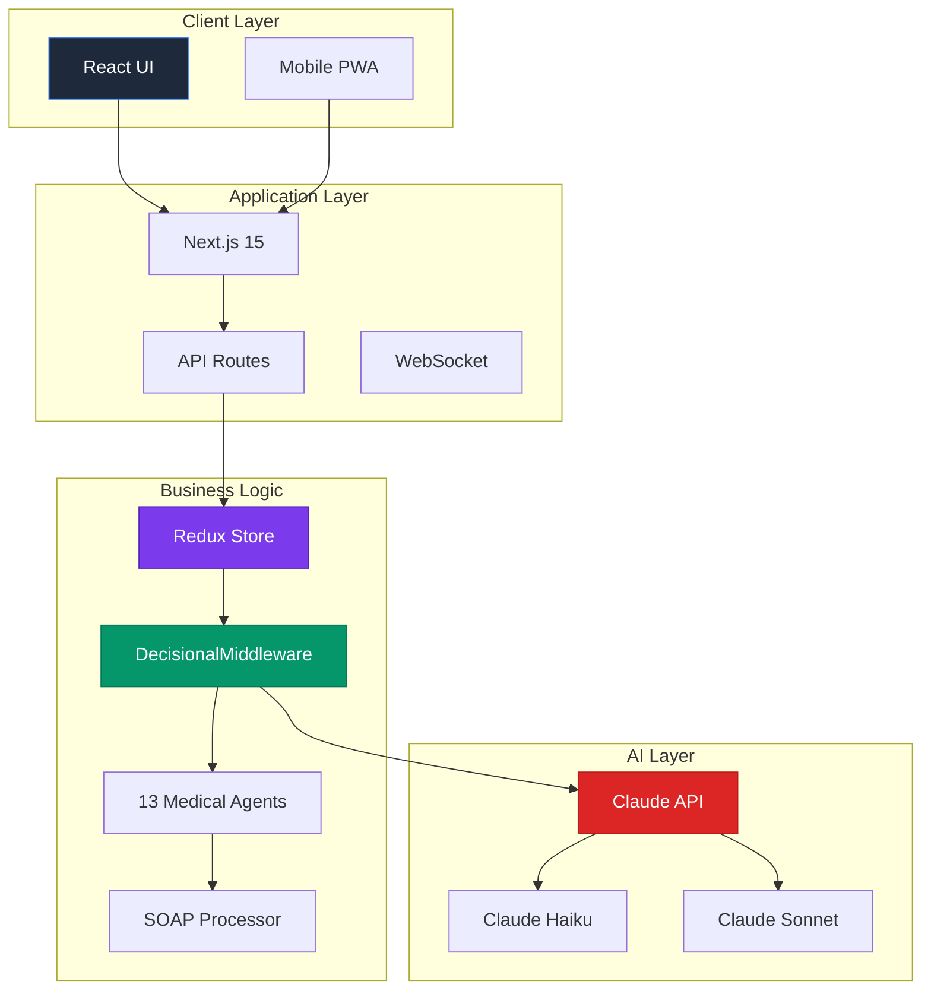

---

## Redux+LLM Architecture

### Cognitive Architecture Pattern

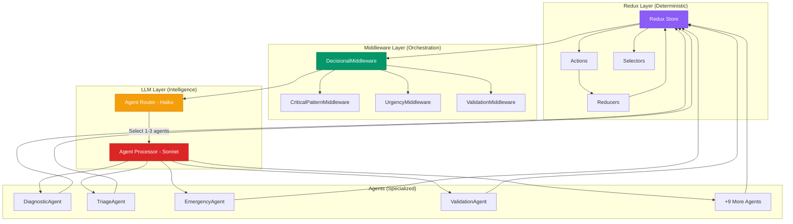

### Redux Action Flow

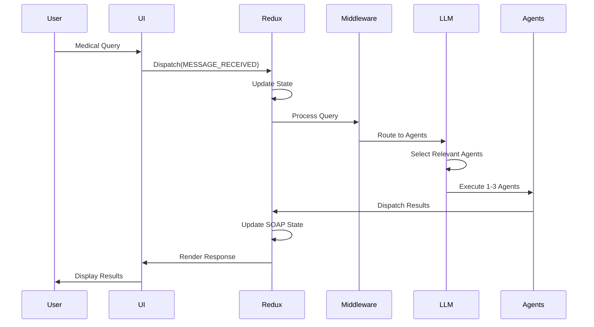

---

## Data Flow

### Complete Request Lifecycle

```mermaid
flowchart LR
    subgraph "Input Processing"
        Input[User Input]
        Sanitize[Sanitize]
        Validate[Validate]
        Extract[Extract Entities]
    end

    subgraph "Context Building"
        History[Get History]
        Patient[Patient Info]
        Context[Build Context]
    end

    subgraph "AI Processing"
        Urgency[Detect Urgency]
        Route[Route Agents]
        Process[Process Query]
        SOAP[Generate SOAP]
    end

    subgraph "Response Generation"
        Format[Format Response]
        Stream[Stream Output]
        Store[Store Results]
    end

    Input --> Sanitize
    Sanitize --> Validate
    Validate --> Extract
    Extract --> History
    History --> Patient
    Patient --> Context
    Context --> Urgency
    Urgency --> Route
    Route --> Process
    Process --> SOAP
    SOAP --> Format
    Format --> Stream
    Stream --> Store

    style Input fill:#3b82f6,stroke:#1e40af,color:#fff
    style Context fill:#8b5cf6,stroke:#7c3aed,color:#fff
    style Process fill:#059669,stroke:#047857,color:#fff
    style Stream fill:#f59e0b,stroke:#d97706,color:#fff
```

---

## Agent Orchestration

### 13 Medical Agents System

```mermaid
graph TD
    subgraph "Routing Layer"
        Router[Intelligent Router<br/>Claude Haiku]
    end

    subgraph "Critical Agents"
        Emergency[EmergencyAgent]
        Triage[TriageAgent]
        Validation[ValidationAgent]
    end

    subgraph "Diagnostic Agents"
        Diagnostic[DiagnosticAgent]
        Pediatric[PediatricAgent]
        Surgical[SurgicalAgent]
    end

    subgraph "Treatment Agents"
        Treatment[TreatmentAgent]
        Mental[MentalHealthAgent]
        Nutrition[NutritionAgent]
    end

    subgraph "Support Agents"
        FollowUp[FollowUpAgent]
        Education[EducationAgent]
        Preventive[PreventiveAgent]
        Rehab[RehabilitationAgent]
    end

    Router --> |"CRITICAL"| Emergency
    Router --> |"CRITICAL"| Triage
    Router --> |"ALL"| Validation

    Router --> |"DIAGNOSTIC"| Diagnostic
    Router --> |"AGE < 18"| Pediatric
    Router --> |"SURGICAL"| Surgical

    Router --> |"TREATMENT"| Treatment
    Router --> |"MENTAL"| Mental
    Router --> |"NUTRITION"| Nutrition

    Router --> |"FOLLOW-UP"| FollowUp
    Router --> |"EDUCATION"| Education
    Router --> |"PREVENTIVE"| Preventive
    Router --> |"REHAB"| Rehab

    style Router fill:#f59e0b,stroke:#d97706,color:#fff
    style Emergency fill:#dc2626,stroke:#b91c1c,color:#fff
    style Triage fill:#dc2626,stroke:#b91c1c,color:#fff
    style Validation fill:#059669,stroke:#047857,color:#fff
```

### Agent Selection Strategy

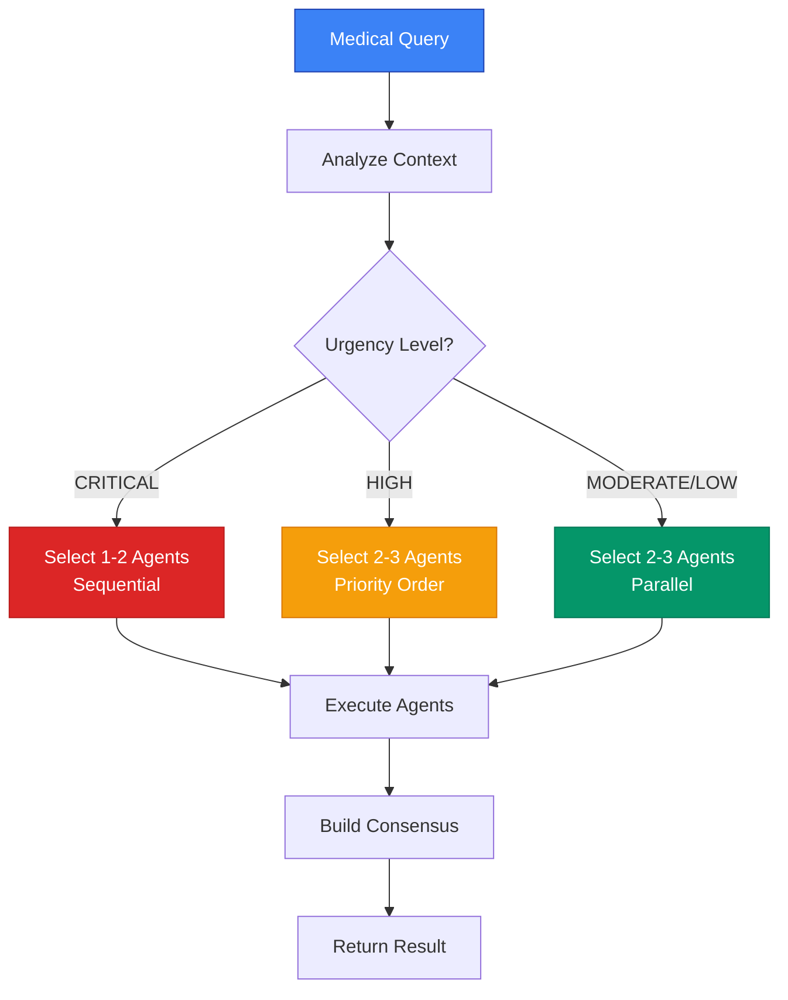

---

## SOAP Processing Pipeline

### SOAP Generation Flow

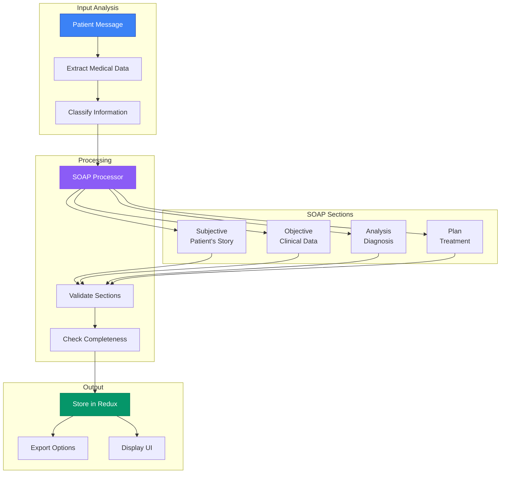

### SOAP Progress Tracking

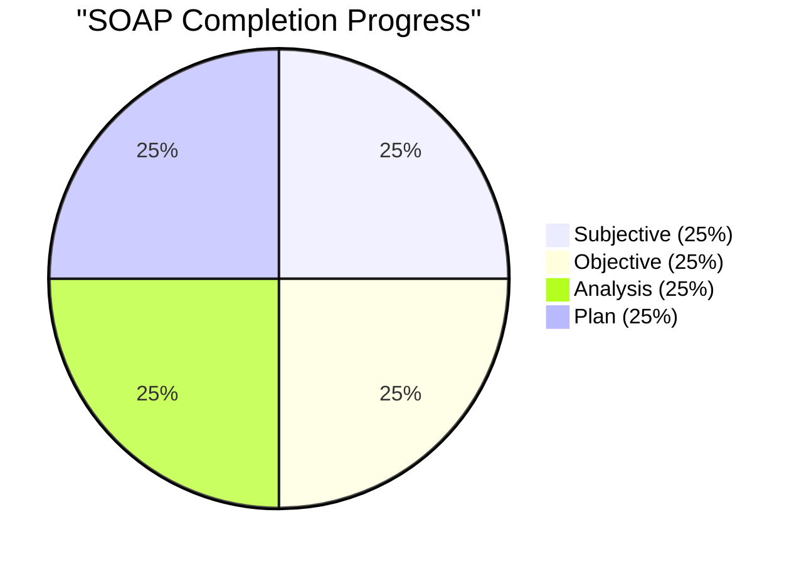

---

## Urgency Detection Flow

### Multi-Layer Urgency System

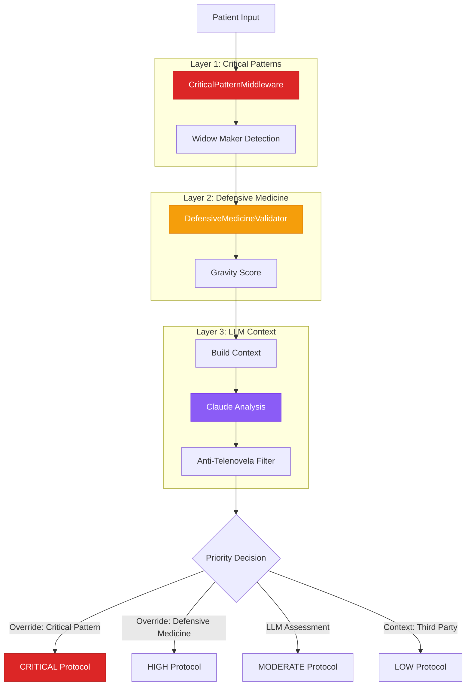

### Anti-Telenovela System

```mermaid
flowchart LR
    Input[User Input]

    Analyze{Who is Patient?}
    Direct[Direct Patient<br/>"Me duele"]
    Parent[Parent with Child<br/>"Mi hijo tiene"]
    Third[Third Party<br/>"Mi vecina dice"]
    Question[Medical Question<br/>"¿Qué opina de?"]

    Temporal{Temporal Context}
    Current[Current Symptoms<br/>"ahora", "tengo"]
    Past[Past Symptoms<br/>"ayer", "tuve"]

    Level[Urgency Level]

    Input --> Analyze

    Analyze -->|First Person| Direct
    Analyze -->|Present Child| Parent
    Analyze -->|Absent Person| Third
    Analyze -->|General Query| Question

    Direct --> Temporal
    Parent --> Temporal
    Third --> |LOW| Level
    Question --> |MODERATE| Level

    Temporal -->|Present| Current
    Temporal -->|Past| Past

    Current --> |Assess Normally| Level
    Past --> |Context Only| Level

    style Input fill:#3b82f6,stroke:#1e40af,color:#fff
    style Direct fill:#059669,stroke:#047857,color:#fff
    style Third fill:#f59e0b,stroke:#d97706,color:#fff
```

---

## Clean Architecture Layers

### Layer Dependencies

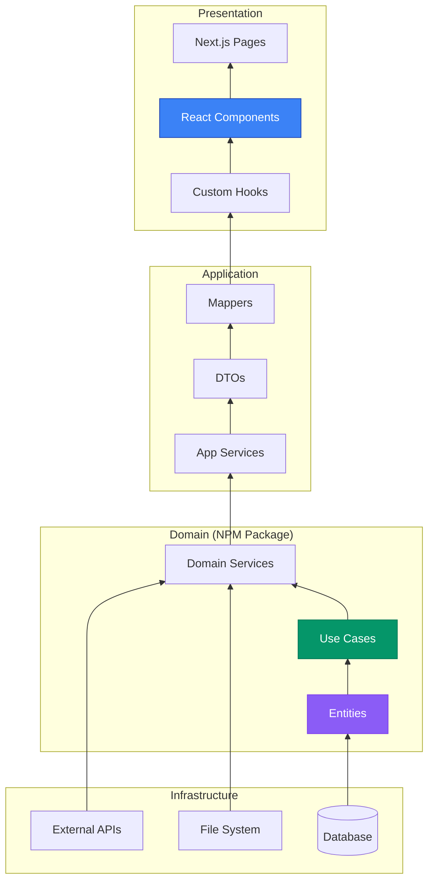

### Package Structure

```mermaid
graph TD
    subgraph "redux-brain-medical-ai (NPM)"
        Core[Core Package]
        Agents[/agents]
        Middleware[/middleware]
        Processors[/processors]
        Store[/store]
        Services[/services]
        Types[/types]
        Utils[/utils]
        Validators[/validators]
    end

    subgraph "Main Application"
        App[Next.js App]
        AppAPI[/api]
        AppComponents[/components]
        AppHooks[/hooks]
        AppLib[/lib]
    end

    Core --> Agents
    Core --> Middleware
    Core --> Processors
    Core --> Store
    Core --> Services
    Core --> Types
    Core --> Utils
    Core --> Validators

    App --> Core
    App --> AppAPI
    App --> AppComponents
    App --> AppHooks
    App --> AppLib

    style Core fill:#8b5cf6,stroke:#7c3aed,color:#fff
    style App fill:#3b82f6,stroke:#1e40af,color:#fff
```

---

## Deployment Architecture

### Production Infrastructure

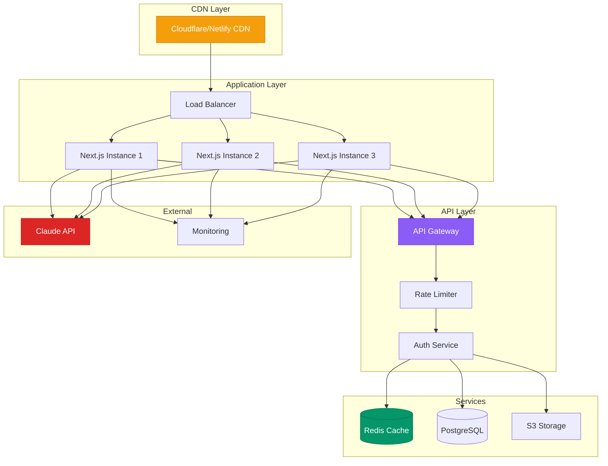

### CI/CD Pipeline

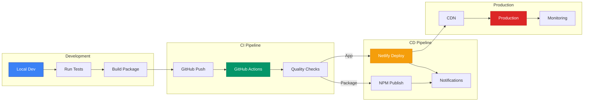

---

## Performance Optimization Flow

### Request Optimization Strategy

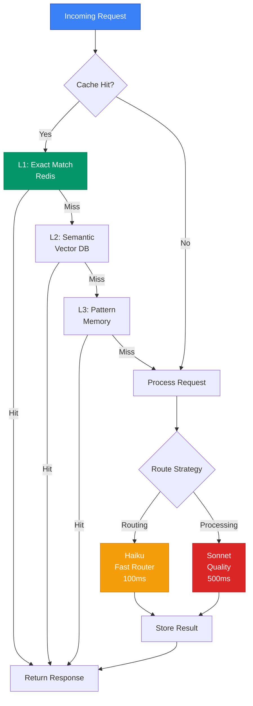

---

**Generated**: 2025-01-16
**Diagrams**: 12
**Format**: Mermaid
**Maintained by**: Bernard Orozco