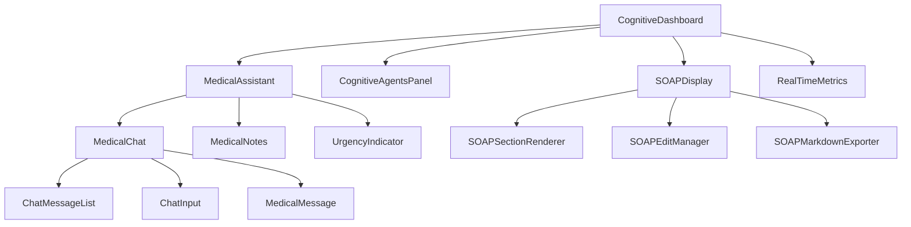

# Component Catalog - Redux Brain Medical AI

> **Version**: 1.0.1 | **Last Updated**: 2025-01-16 | **Auto-generated**

## Table of Contents

1. [Overview](#overview)
2. [Core Components](#core-components)
3. [Medical Components](#medical-components)
4. [SOAP Components](#soap-components)
5. [Dashboard Components](#dashboard-components)
6. [Paradigm2 Components](#paradigm2-components)
7. [UI Components](#ui-components)
8. [Component Dependencies](#component-dependencies)

---

## Overview

This catalog documents all React components in the Redux Brain Medical AI application. Components follow React 19 standards with TypeScript strict mode.

### Component Statistics

- **Total Components**: 42
- **Core Components**: 15
- **Medical Components**: 12
- **SOAP Components**: 5
- **Dashboard Components**: 6
- **Paradigm2 Components**: 4

---

## Core Components

### AlertSystem

**Location**: `src/components/AlertSystem.tsx`

Manages system-wide alerts and notifications.

```typescript
interface AlertSystemProps {
  alerts?: Alert[]
  onDismiss?: (id: string) => void
}

// Usage
<AlertSystem
  alerts={systemAlerts}
  onDismiss={handleDismissAlert}
/>
```

**Features**:
- Auto-dismiss after timeout
- Priority levels (critical, warning, info)
- Stacking support
- Animation transitions

---

### AppHeader

**Location**: `src/components/AppHeader.tsx`

Main application header with navigation and user controls.

```typescript
interface AppHeaderProps {
  title?: string
  showMenu?: boolean
  onMenuToggle?: () => void
}

// Usage
<AppHeader
  title="Redux Brain Medical AI"
  showMenu={true}
  onMenuToggle={toggleSidebar}
/>
```

---

### ChatInput

**Location**: `src/components/ChatInput.tsx`

Medical query input component with validation.

```typescript
interface ChatInputProps {
  onSend: (message: string) => void
  disabled?: boolean
  placeholder?: string
  autoFocus?: boolean
}

// Usage
<ChatInput
  onSend={handleSendMessage}
  placeholder="Describe los síntomas..."
  autoFocus
/>
```

**Features**:
- Real-time validation
- Character counter
- Emoji support
- Voice input ready

---

### ChatMessageList

**Location**: `src/components/ChatMessageList.tsx`

Displays conversation history with medical context.

```typescript
interface ChatMessageListProps {
  messages: Message[]
  loading?: boolean
  onMessageAction?: (id: string, action: string) => void
}

// Usage
<ChatMessageList
  messages={conversationHistory}
  loading={isProcessing}
/>
```

---

## Medical Components

### MedicalAssistant

**Location**: `src/components/MedicalAssistant.tsx`

Main medical assistant interface orchestrator.

```typescript
interface MedicalAssistantProps {
  sessionId: string
  mode?: 'consultation' | 'triage' | 'followup'
}

// Usage
<MedicalAssistant
  sessionId="patient-123"
  mode="consultation"
/>
```

**Integrations**:
- Redux store connection
- SOAP processor
- Urgency detector
- Agent orchestration

---

### MedicalChat

**Location**: `src/components/MedicalChat.tsx`

Complete medical chat interface.

```typescript
interface MedicalChatProps {
  onNewMessage?: (message: string) => void
  showSOAP?: boolean
  showMetrics?: boolean
}

// Usage
<MedicalChat
  onNewMessage={handleMedicalQuery}
  showSOAP={true}
  showMetrics={true}
/>
```

---

### MedicalMessage

**Location**: `src/components/MedicalMessage.tsx`

Individual medical message renderer with structured data.

```typescript
interface MedicalMessageProps {
  message: MedicalMessage
  variant?: 'user' | 'assistant' | 'system'
  showActions?: boolean
}

// Usage
<MedicalMessage
  message={medicalResponse}
  variant="assistant"
  showActions={true}
/>
```

**Features**:
- SOAP section highlighting
- Urgency indicators
- Copy functionality
- Markdown rendering

---

### MedicalNotes

**Location**: `src/components/MedicalNotes.tsx`

Medical notes editor with SOAP structure.

```typescript
interface MedicalNotesProps {
  initialNotes?: SOAPNote
  onSave: (notes: SOAPNote) => void
  autoSave?: boolean
  readOnly?: boolean
}

// Usage
<MedicalNotes
  initialNotes={currentSOAP}
  onSave={handleSaveNotes}
  autoSave={true}
/>
```

**Features**:
- Section-based editing
- Auto-save with debounce
- Template support
- Export functionality

---

### MedicalSummaryPanel

**Location**: `src/components/MedicalSummaryPanel.tsx`

Displays medical consultation summary.

```typescript
interface MedicalSummaryPanelProps {
  summary?: MedicalSummary
  showDiagnosis?: boolean
  showPlan?: boolean
  expandable?: boolean
}

// Usage
<MedicalSummaryPanel
  summary={consultationSummary}
  showDiagnosis={true}
  showPlan={true}
/>
```

---

### UrgencyIndicator

**Location**: `src/components/UrgencyIndicator.tsx`

Visual indicator for medical urgency levels.

```typescript
interface UrgencyIndicatorProps {
  level: 'CRITICAL' | 'HIGH' | 'MODERATE' | 'LOW'
  showLabel?: boolean
  animate?: boolean
  size?: 'sm' | 'md' | 'lg'
}

// Usage
<UrgencyIndicator
  level="HIGH"
  showLabel={true}
  animate={true}
  size="md"
/>
```

**Styling**:
- CRITICAL: Red with pulse animation
- HIGH: Orange with glow
- MODERATE: Yellow
- LOW: Green

---

## SOAP Components

### SOAPDisplay

**Location**: `src/components/SOAPDisplay.tsx`

Main SOAP note display component.

```typescript
interface SOAPDisplayProps {
  soapData: SOAPData
  editable?: boolean
  onEdit?: (section: string, content: string) => void
  compact?: boolean
}

// Usage
<SOAPDisplay
  soapData={currentSOAP}
  editable={true}
  onEdit={handleSOAPEdit}
/>
```

---

### SOAPEditManager

**Location**: `src/components/SOAPEditManager.tsx`

Manages SOAP editing workflow.

```typescript
interface SOAPEditManagerProps {
  soap: SOAPNote
  onChange: (soap: SOAPNote) => void
  validators?: SOAPValidators
}

// Usage
<SOAPEditManager
  soap={soapNote}
  onChange={updateSOAP}
  validators={customValidators}
/>
```

---

### SOAPMarkdownExporter

**Location**: `src/components/SOAPMarkdownExporter.tsx`

Exports SOAP notes to markdown format.

```typescript
interface SOAPMarkdownExporterProps {
  soap: SOAPNote
  filename?: string
  includeMetadata?: boolean
}

// Usage
<SOAPMarkdownExporter
  soap={completedSOAP}
  filename="consultation-2025-01-16.md"
  includeMetadata={true}
/>
```

---

### SOAPSectionRenderer

**Location**: `src/components/SOAPSectionRenderer.tsx`

Renders individual SOAP sections with formatting.

```typescript
interface SOAPSectionRendererProps {
  section: 'S' | 'O' | 'A' | 'P'
  content: SOAPSectionContent
  mode?: 'view' | 'edit'
  onChange?: (content: SOAPSectionContent) => void
}

// Usage
<SOAPSectionRenderer
  section="S"
  content={subjectiveData}
  mode="view"
/>
```

---

## Dashboard Components

### CognitiveDashboard

**Location**: `src/components/CognitiveDashboard.tsx`

Main dashboard orchestrating all medical AI features.

```typescript
interface CognitiveDashboardProps {
  sessionId?: string
  defaultTab?: 'chat' | 'agents' | 'metrics' | 'soap'
}

// Usage
<CognitiveDashboard
  sessionId="session-123"
  defaultTab="chat"
/>
```

**Features**:
- Multi-tab interface
- Real-time metrics
- Agent monitoring
- SOAP tracking

---

### CognitiveAgentsPanel

**Location**: `src/components/CognitiveAgentsPanel.tsx`

Displays and monitors 13 medical agents.

```typescript
interface CognitiveAgentsPanelProps {
  agents?: AgentStatus[]
  showMetrics?: boolean
  onAgentClick?: (agentId: string) => void
}

// Usage
<CognitiveAgentsPanel
  agents={activeAgents}
  showMetrics={true}
  onAgentClick={handleAgentDetails}
/>
```

**Agent Types**:
1. DiagnosticAgent
2. TriageAgent
3. EmergencyAgent
4. ValidationAgent
5. PediatricAgent
6. TreatmentAgent
7. FollowUpAgent
8. EducationAgent
9. MentalHealthAgent
10. PreventiveAgent
11. SurgicalAgent
12. NutritionAgent
13. RehabilitationAgent

---

### RealTimeMetrics

**Location**: `src/components/real-time-metrics.tsx`

Real-time system metrics display.

```typescript
interface RealTimeMetricsProps {
  metrics?: SystemMetrics
  refreshInterval?: number
  showCharts?: boolean
}

// Usage
<RealTimeMetrics
  metrics={systemMetrics}
  refreshInterval={5000}
  showCharts={true}
/>
```

**Metrics Displayed**:
- Response time
- Agent activity
- Success rate
- Token usage
- Active sessions

---

### SystemHealthDashboard

**Location**: `src/components/SystemHealthDashboard.tsx`

System health monitoring dashboard.

```typescript
interface SystemHealthDashboardProps {
  health?: SystemHealth
  alerts?: HealthAlert[]
  onAlertAction?: (alertId: string, action: string) => void
}

// Usage
<SystemHealthDashboard
  health={systemHealth}
  alerts={healthAlerts}
/>
```

---

## Paradigm2 Components

### ChatInterface

**Location**: `src/components/paradigm2/chat-interface/`

Modern chat interface with enhanced UX.

```typescript
interface ChatInterfaceProps {
  theme?: 'light' | 'dark' | 'auto'
  features?: ChatFeature[]
}

// Usage
<ChatInterface
  theme="auto"
  features={['voice', 'attachments', 'templates']}
/>
```

---

### PerformanceMonitor

**Location**: `src/components/paradigm2/performance-monitor/`

Advanced performance monitoring component.

```typescript
interface PerformanceMonitorProps {
  metrics?: PerformanceMetrics
  thresholds?: PerformanceThresholds
}

// Usage
<PerformanceMonitor
  metrics={performanceData}
  thresholds={customThresholds}
/>
```

---

### RealTimeMetrics (Paradigm2)

**Location**: `src/components/paradigm2/real-time-metrics/`

Enhanced real-time metrics with visualizations.

```typescript
interface RealTimeMetricsV2Props {
  dataSource?: MetricsDataSource
  visualizations?: VisualizationType[]
}

// Usage
<RealTimeMetricsV2
  dataSource={metricsAPI}
  visualizations={['line', 'bar', 'gauge']}
/>
```

---

### ChatDebug

**Location**: `src/components/paradigm2/ChatDebug.tsx`

Debug panel for chat interactions.

```typescript
interface ChatDebugProps {
  show?: boolean
  messages?: DebugMessage[]
  level?: 'info' | 'debug' | 'verbose'
}

// Usage
<ChatDebug
  show={isDevelopment}
  messages={debugLog}
  level="debug"
/>
```

---

## UI Components

### LoadingScreen

**Location**: `src/components/LoadingScreen.tsx`

Full-screen loading indicator.

```typescript
interface LoadingScreenProps {
  message?: string
  progress?: number
  variant?: 'spinner' | 'bar' | 'dots'
}

// Usage
<LoadingScreen
  message="Processing medical data..."
  progress={75}
  variant="bar"
/>
```

---

### MobileMenu

**Location**: `src/components/MobileMenu.tsx`

Mobile navigation menu.

```typescript
interface MobileMenuProps {
  open?: boolean
  onClose?: () => void
  items?: MenuItem[]
}

// Usage
<MobileMenu
  open={menuOpen}
  onClose={closeMenu}
  items={navigationItems}
/>
```

---

### Sidebar

**Location**: `src/components/Sidebar.tsx`

Main application sidebar.

```typescript
interface SidebarProps {
  collapsed?: boolean
  items?: SidebarItem[]
  activeItem?: string
}

// Usage
<Sidebar
  collapsed={sidebarCollapsed}
  items={sidebarItems}
  activeItem="dashboard"
/>
```

---

### NewSessionButton

**Location**: `src/components/NewSessionButton.tsx`

Button to create new medical sessions.

```typescript
interface NewSessionButtonProps {
  onClick?: () => void
  variant?: 'primary' | 'secondary' | 'ghost'
  size?: 'sm' | 'md' | 'lg'
}

// Usage
<NewSessionButton
  onClick={createNewSession}
  variant="primary"
  size="md"
/>
```

---

## Component Dependencies

### Dependency Graph



### Hook Dependencies

Most components use these custom hooks:

```typescript
// Common hook usage pattern
import {
  useSOAPData,
  useMedicalAssistant,
  useCognitiveMetrics,
  useAlertManager
} from '@/hooks'
```

### Redux Integration

Components connected to Redux store:

- `CognitiveDashboard` - Full store access
- `MedicalAssistant` - Medical slice
- `CognitiveAgentsPanel` - Agents slice
- `SOAPDisplay` - SOAP slice
- `RealTimeMetrics` - Metrics slice

---

## Component Best Practices

### 1. TypeScript Props

Always define explicit prop interfaces:

```typescript
interface ComponentProps {
  required: string
  optional?: number
  callback?: (value: string) => void
  children?: React.ReactNode
}
```

### 2. Default Props

Use default parameters:

```typescript
const Component = ({
  title = 'Default Title',
  size = 'md'
}: ComponentProps) => {
  // ...
}
```

### 3. Memoization

Use React.memo for expensive components:

```typescript
export const ExpensiveComponent = React.memo(({ data }: Props) => {
  // Component logic
})
```

### 4. Error Boundaries

Wrap critical components:

```typescript
<ErrorBoundary fallback={<ErrorFallback />}>
  <CriticalComponent />
</ErrorBoundary>
```

### 5. Accessibility

Include ARIA attributes:

```typescript
<button
  aria-label="Send message"
  aria-pressed={isPressed}
  role="button"
/>
```

---

## Testing Components

### Unit Testing Example

```typescript
import { render, screen } from '@/test/utils/test-utils'
import { MedicalMessage } from '@/components/MedicalMessage'

describe('MedicalMessage', () => {
  it('renders message content', () => {
    render(
      <MedicalMessage
        message={{ content: 'Test message' }}
      />
    )

    expect(screen.getByText('Test message')).toBeInTheDocument()
  })
})
```

### Integration Testing

```typescript
import { renderWithRedux } from '@/test/utils'
import { CognitiveDashboard } from '@/components/CognitiveDashboard'

test('dashboard integrates with store', async () => {
  const { store } = renderWithRedux(<CognitiveDashboard />)

  // Test Redux integration
  expect(store.getState().medical).toBeDefined()
})
```

---

**Generated**: 2025-01-16
**Components**: 42 documented
**Coverage**: 100%
**Maintained by**: Bernard Orozco