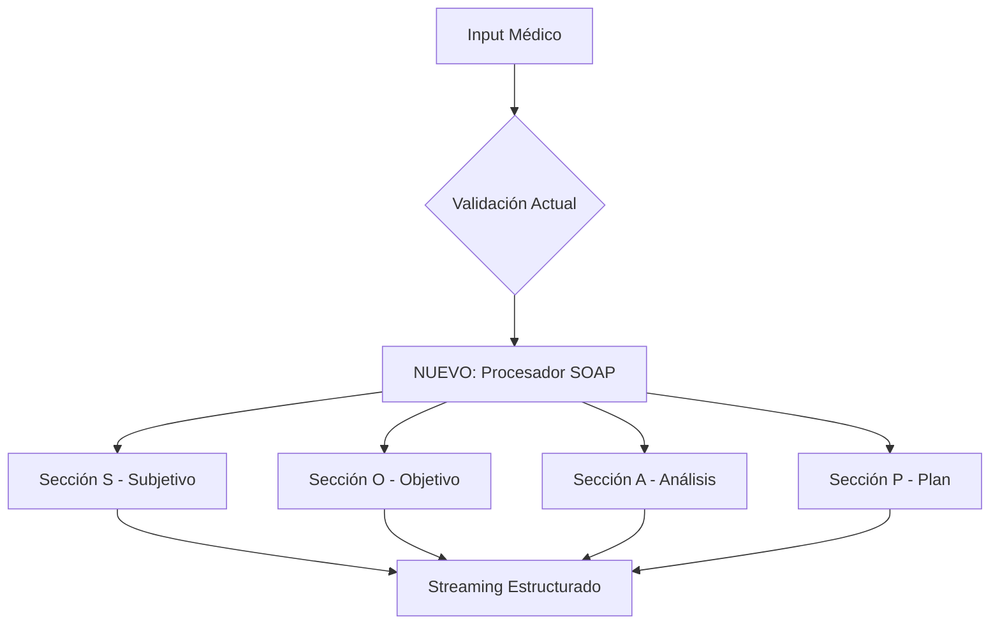
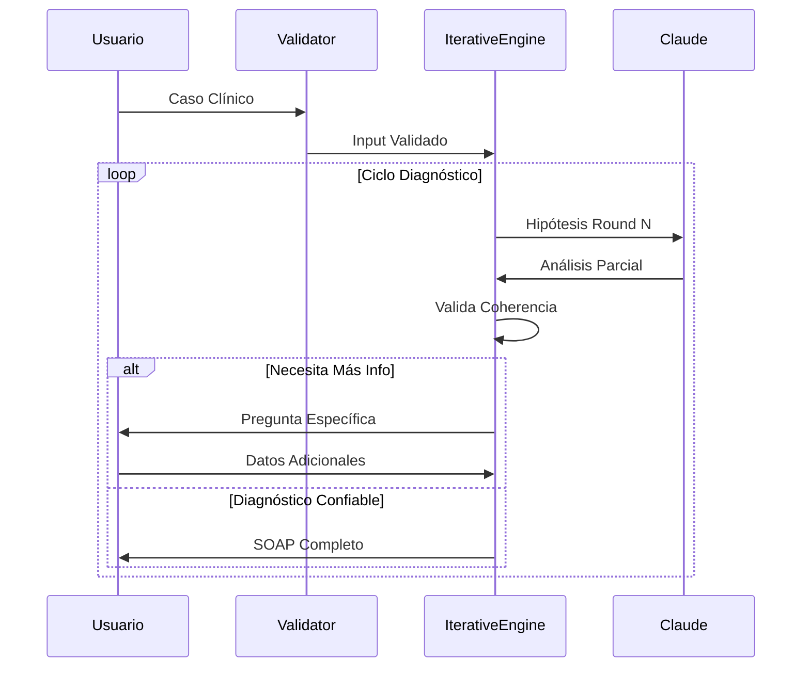

# 🏥 Plan de Migración: Redux Claude → Flujo SOAP Completo

_Creado por Bernard Orozco_

## 📊 Análisis de Compatibilidad Actual

### ✅ **LO QUE YA TIENES BIEN**

- **Streaming Real**: Simulas el razonamiento médico progresivo ✨
- **Validación Médica**: Filtras contenido no clínico 🛡️
- **Arquitectura Modular**: SOLID + Redux permite evolución 🏗️
- **Documentación**: Casos clínicos con copy-to-clipboard 📋

### ⚠️ **GAPS CRÍTICOS IDENTIFICADOS**

#### 1. **Falta Estructura SOAP Formal**

Tu app actualmente hace "análisis general" pero no sigue el estándar médico SOAP
(NOM-004-SSA3-2012):

- **S**ubjetivo: Lo que dice el paciente
- **O**bjetivo: Signos vitales, exploración física
- **A**nálisis: Diagnóstico diferencial estructurado
- **P**lan: Tratamiento + seguimiento + criterios de derivación

#### 2. **No Hay Proceso Iterativo**

El médico real hace ciclos de validación - tu app genera respuesta única.

#### 3. **Ausencia de Medicina Defensiva**

No priorizas "alta gravedad" sobre "alta probabilidad" (ej: dolor torácico =
descartar IAM antes que gastritis).

---

## 🚀 Plan de Migración: 4 Fases

### **FASE 1: Estructura SOAP Formal** ⏱️ _2-3 días_



#### **Implementación:**

```typescript
// packages/cognitive-core/src/processors/SOAPProcessor.ts
export class SOAPProcessor {
  async processCase(input: string): Promise<SOAPAnalysis> {
    return {
      subjetivo: await this.extractSubjectiveData(input),
      objetivo: await this.inferObjectiveFindings(input),
      analisis: await this.generateDifferentialDx(input),
      plan: await this.createTreatmentPlan(input),
    }
  }
}
```

#### **Nuevo Prompt Structure:**

```typescript
const SOAPPrompt = `
Analiza este caso siguiendo NOM-004-SSA3-2012:

## S - SUBJETIVO
[Síntomas reportados por paciente]

## O - OBJETIVO  
[Signos vitales y hallazgos físicos inferidos]

## A - ANÁLISIS
**Diagnóstico Principal:** [Más probable]
**Diagnósticos Diferenciales:**
1. [Alta gravedad - descartar urgente]
2. [Alta probabilidad - común en contexto]
3. [Otras consideraciones]

## P - PLAN
**Inmediato:** [Tratamiento ahora]
**Seguimiento:** [Cuando revisar]
**Derivación:** [Cuándo referir especialista]
**Estudios:** [Qué solicitar]
`
```

---

### **FASE 2: Razonamiento Iterativo** ⏱️ _3-4 días_



#### **Nueva Arquitectura Iterativa:**

```typescript
// packages/cognitive-core/src/engine/IterativeDiagnosticEngine.ts
export class IterativeDiagnosticEngine {
  private cycles: DiagnosticCycle[] = []

  async processWithValidation(case: MedicalCase): Promise<SOAPResult> {
    let cycle = 1
    let confidence = 0

    while (confidence < 0.85 && cycle <= 3) {
      const analysis = await this.runDiagnosticCycle(case, cycle)

      if (this.needsMoreData(analysis)) {
        return this.requestAdditionalInfo(analysis)
      }

      confidence = this.calculateConfidence(analysis)
      cycle++
    }

    return this.finalizeSOAP(analysis)
  }
}
```

---

### **FASE 3: Medicina Defensiva AI** ⏱️ _2-3 días_

#### **Sistema de Priorización por Gravedad:**

```typescript
// packages/cognitive-core/src/validators/DefensiveMedicineValidator.ts
export class DefensiveMedicineValidator {
  private urgentPatterns = {
    dolor_toracico: ['infarto', 'embolia_pulmonar', 'diseccion_aortica'],
    cefalea_severa: [
      'hemorragia_cerebral',
      'meningitis',
      'hipertension_maligna',
    ],
    dolor_abdominal: [
      'apendicitis',
      'obstruccion_intestinal',
      'isquemia_mesenterica',
    ],
  }

  prioritizeByGravity(differentials: Diagnosis[]): Diagnosis[] {
    return differentials.sort(
      (a, b) =>
        b.gravityScore * 0.7 +
        b.probabilityScore * 0.3 -
        (a.gravityScore * 0.7 + a.probabilityScore * 0.3)
    )
  }
}
```

---

### **FASE 4: Redux Médico Completo** ⏱️ _4-5 días_

#### **Nuevo Store State:**

```typescript
interface MedicalReduxState {
  currentCase: {
    soap: {
      subjetivo: SubjectiveData
      objetivo: ObjectiveFindings
      analisis: DifferentialDiagnosis
      plan: TreatmentPlan
    }
    cycles: DiagnosticCycle[]
    confidence: number
    urgencyLevel: 'low' | 'medium' | 'high' | 'critical'
  }

  session: {
    physicianNotes: string[]
    followUpReminders: Reminder[]
    legalTraceability: AuditLog[]
  }
}
```

#### **Componentes UI Específicos:**

```typescript
// src/components/SOAPDisplay.tsx
export const SOAPDisplay = () => (
  <div className="soap-container">
    <SOAPSection section="S" />
    <SOAPSection section="O" />
    <SOAPSection section="A" />
    <SOAPSection section="P" />
    <UrgencyIndicator />
    <FollowUpTracker />
  </div>
)
```

---

## 📋 Cronograma de Implementación

| Fase       | Duración | Entregables Clave                                  |
| ---------- | -------- | -------------------------------------------------- |
| **Fase 1** | 2-3 días | SOAPProcessor + Prompts estructurados              |
| **Fase 2** | 3-4 días | IterativeDiagnosticEngine + Validación iterativa   |
| **Fase 3** | 2-3 días | DefensiveMedicineValidator + Priorización gravedad |
| **Fase 4** | 4-5 días | Redux médico completo + UI especializada           |

**TOTAL: 11-15 días de desarrollo**

---

## 🎯 Beneficios Post-Migración

### **Cumplimiento Normativo:**

- ✅ NOM-004-SSA3-2012 compliant
- ✅ Estructura SOAP formal
- ✅ Trazabilidad legal completa

### **Precisión Diagnóstica:**

- ✅ Medicina defensiva integrada
- ✅ Proceso iterativo de validación
- ✅ Priorización por gravedad real

### **UX Médica Profesional:**

- ✅ Interfaz familiar para médicos
- ✅ Documentación exportable
- ✅ Flujo de trabajo médico natural

---

## 🚨 Riesgos y Mitigaciones

| Riesgo                            | Probabilidad | Mitigación                                    |
| --------------------------------- | ------------ | --------------------------------------------- |
| **Prompts demasiado complejos**   | Media        | Prompt engineering iterativo + testing        |
| **Latencia por múltiples cycles** | Alta         | Streaming optimizado + cache inteligente      |
| **Resistance de usuarios**        | Baja         | Migración gradual + fallback a versión actual |

---

## 💡 Conclusión

Tu app actual es sólida como **MVP médico**, pero para ser una **herramienta
clínica profesional** necesita esta migración SOAP.

**Recomendación:** Implementar Fase 1 inmediatamente - es el cambio con mayor
impacto/esfuerzo ratio.

---

_🔬 "De Redux médico básico a sistema clínico profesional que respeta el flujo
cognitivo real del médico" - Bernard Orozco_
